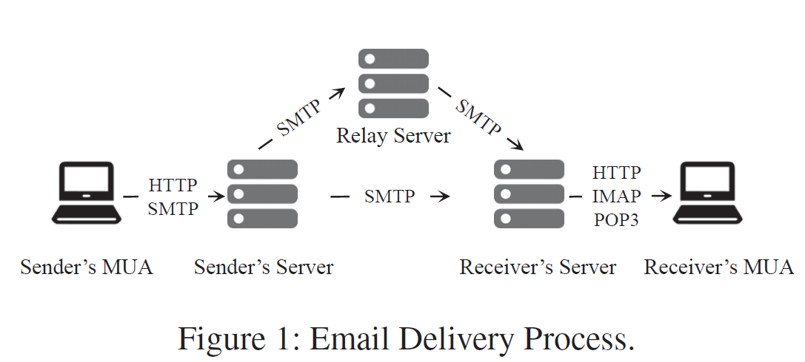
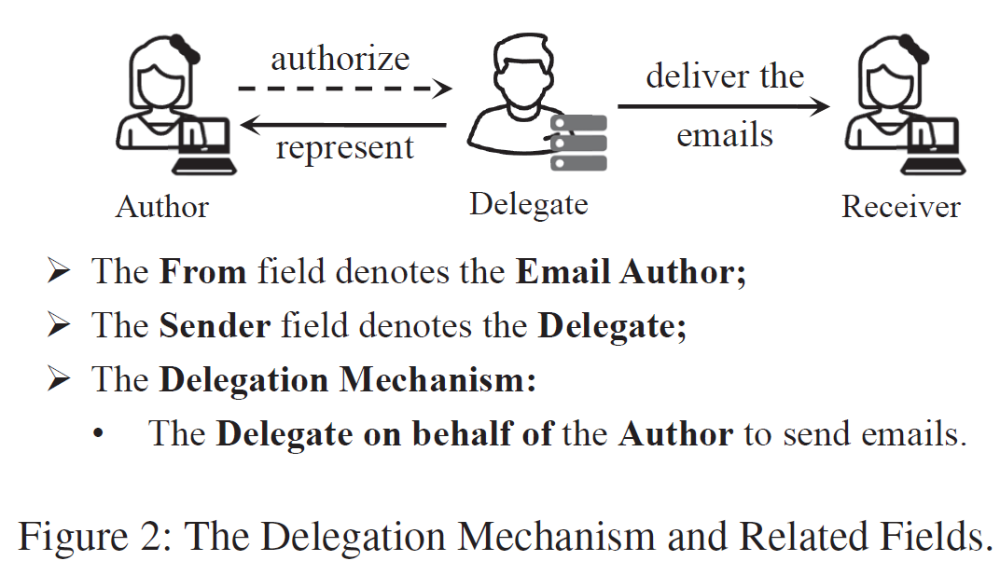
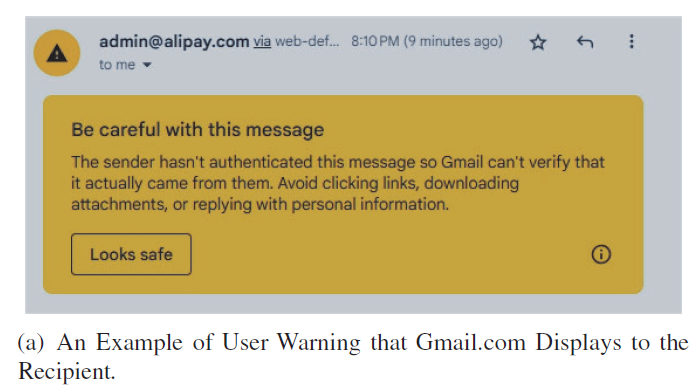
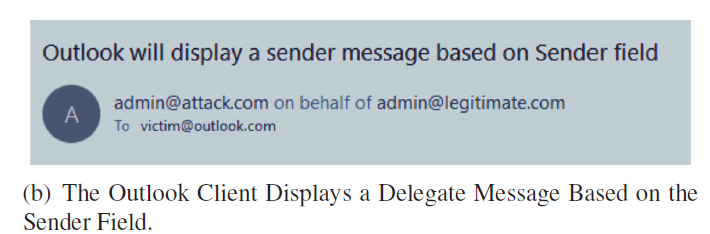
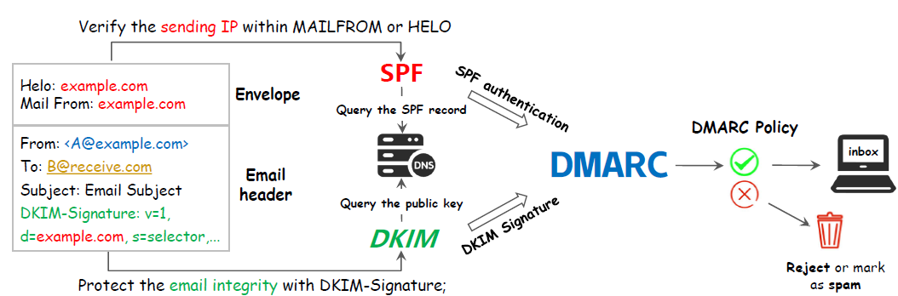
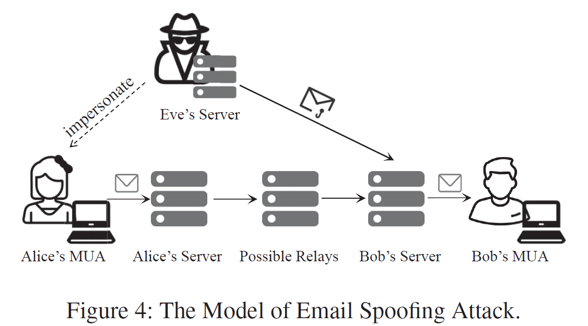
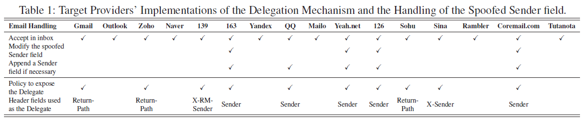

# 邮件安全

## 基础知识

邮件是用于全球通信的关键服务。

> How many emails are sent per day 2025?
> **Answer:** 347.3 billion emails are sent per day. That means that more than 4 million emails are sent per second.
> **Link:** https://earthweb.com/blog/how-many-emails-are-sent-per-day

邮件非常便利，但是也包含私密的信息，邮件经常被用于网络钓鱼攻击。恶意邮件威胁能够绕过`secure email gateways (SEGs)`，邮件也是网络犯罪排名第一的威胁，有90%的数据泄露来源于钓鱼邮件。因此，电子邮件威胁的持续存在对网络安全构成了严峻的挑战。

### 基本概念

**Email Header:** 邮件头是邮件本身的组成部分之一，包含关于邮件的关键信息，如邮件的发件人、收件人、主题、日期等。邮件头的内容主要是描述邮件的元数据和控制信息，通常由邮件发送方在邮件创建时生成，并由邮件客户端和服务器一起处理。常见的邮件头字段包括：

- From: 发件人的地址
- To: 收件人的地址
- Subject: 邮件的主题
- Date: 邮件的发送日期
- Reply-To: 回复邮件的地址
- Message-ID: 邮件的唯一标识符
- CC/BCC: 抄送/密送的地址
- Content-Type: 邮件内容的类型，例如文本、HTML、附件等

**Envelope:** 指邮件的传输信息，并不包含在邮件内容本身中，由邮件传输过程中用于控制邮件的传递和投递的元数据。主要由邮件服务器进行处理，决定邮件的**路由、传送路径以及最终的收件人**。通常包括以下信息：
- MAIL FROM: 发送者的地址，用于处理邮件回退或错误
- RCPT TO: 接收者的地址，用于确定邮件的目的地
- Return-Path: 返回地址，通常是MAIL FROM的地址，用于处理退回邮件

#### SMTP协议

Simple Mail Transfer Protocol (SMTP)是一种用于电子邮件传输的标准通信协议，允许邮件从一个服务器发送到另一个服务器，确保从发件方正确地传输到接收方。SMTP是一种基于文本的协议，主要用于发送电子邮件，客户端与服务器之间通过命令与响应完成邮件发送过程。常见的命令包括：
- HELO: 客户端向邮件服务器打招呼，标识自身并开始一轮会话 `HELO domain` 标识发邮件的客户端的主机名或域名。如果服务器接受连接并且没有问题，则返回类似响应。
  - 请求：`HELO mail.example.com`
  - 响应：`250 Hello mail.example.com [<IP>], pleased to meet you `
- MAIL FROM: 告诉邮件服务器邮件的**发件人**是谁，`MAIL FROM: <email_address>`，此处代表的是发件人的电子邮件地址。同样，如果邮件服务器接受发件人的地址，会返回类似的响应。
  - 请求：`MAIL FROM: <sender@example.com>`
  - 响应：`250 2.1.0 <sender@example.com> ... Sender OK`
- DATA: 指示邮件服务器准备接收邮件的正文内容，即邮件的实际内容，包括头信息和正文
  - 服务器响应：`354 Start mail input; end with <CRLF>.<CRLF>`
  - 接下来，客户端发送邮件内容，包括邮件头`From`、`To`、`Subject`等和正文等。发送完邮件内容后，客户端用一个单独的`.`标识邮件结束。`From: xxx To: yyy Subject: zzz This is the body of the email. .`
  - 服务器响应：`250 2.0.0 OK`
- RCPT TO: 指定收件人的电子邮件地址
  - `RCPT TO:<email_address>` 
- QUIT: 结束当前的会话

**一般来说，总体流程：**
- 建立连接并打招呼 HELO
- 指定发件人 MAIL FROM
  - 此过程中，通常有SPF认证
  - 收到收件人的响应后，发件服务器通过`DATA`命令发送邮件
- 指定收件人 RCPT TO
- 输入邮件内容 DATA
- 结束会话 QUIT

整体流程如下图：  

  

邮件作者使用`Mail User Agent (MUA)` 生成邮件，使用web接口或邮件客户端生成。随后，邮件通过SMTP或HTTP发送到transport服务器。接下来，邮件在到达收件人服务器之前会经过几个转发的服务器，该服务器通过IMAP、POP3或者HTTP将邮件传递到收件人的邮箱。

随着现代互联网的发展，大型企业采用特定的邮件服务器集中处理邮件。来自不同来源的电子邮件会在专用的代理中组装，共同处理和传输。相似的是，邮件用户可以授权其它实体代表他们，称为委托机制，如下图：  

   

当电子邮件作者`Author`与代理人`Delegate`不一致时，机制会带来挑战。此外，也有必要在邮件中记录分发代理的邮件地址，以便在邮件没有送达的时候回退邮件，同时也能够记录原始的邮件作者。为了解决这个问题，RFC 5322在`email header`中标识了两个字段：  

- `From`: 表示邮件的地址，在邮件中非常重要 
- `Sender`: 是可选的字段，标明分发邮件的代理。

当代理代表其它实体分发邮件时，需要使用`Sender`字段记录自身作为`Delegate`的地址。`Sender`字段是特定为`Delegation Mechanism`设计的，如果与`From`字段是一致的话，就会被忽略。

#### Email Spoofing Attacks

在众多的邮件威胁中，邮件伪造攻击是特别需要关心的，攻击者可能采用不同的策略伪装成合法实体发送欺诈性邮件欺骗收件人并获取信任。为了应对此类恶意邮件，采取了不同的防御方法，其中`email header`在其中扮演重要的角色。`From`字段，其中标示着信息的作者，即邮件作者具有特别的意义。很多研究都是采用恶意伪造`From`字段来构造欺诈电子邮件，也是电子邮件验证方案和协议的核心焦点。

攻击者伪造电子邮件的发件人地址，使得邮件看起来像是合法或可信的来源，但实际是攻击者发出的。攻击目的是欺骗收件人，达到恶意目的，例如传播恶意软件、进行钓鱼攻击、欺诈或破坏企业的声誉。

**工作原理：**

1. 伪造发件人地址：攻击者修改邮件头部信息，伪造合法发件人地址。
2. 绕过反垃圾邮件技术：大多数电子邮件服务都依赖发件人地址和域名进行过滤，攻击者通常使用未经过认证的域名，甚至利用合法域名的变体 `paypal.com`👉`paypa1.com`，可能可以绕过简单的过滤系统。
3. 伪造邮件内容：邮件内容可能包含恶意链接、附件或请求用户提供敏感信息（如密码、信用卡号等），通常用于钓鱼攻击。

**影响：**

- 身份盗窃：攻击者通过伪造可信的电子邮件，从受害人那里窃取敏感信息
- 恶意软件传播：攻击者通过伪造邮件附件传播病毒或病毒
- 财务欺诈：攻击者可能伪造银行或公司邮件，诱使受害人进行不当的资金转移
- 声誉损害：企业可能因为其邮件系统被利用进行欺诈或其他恶意行为而遭受声誉损害

**防御方法：**

**邮件认证协议：**原本的SMTP协议缺少对电子邮件作者的身份认证，允许互联网中的任何人冒充他人发送邮件。为了解决这个问题，很多扩展用于增强电子邮件传输的安全性，最广泛使用的三类：SPF，DKIM和DMARC

- **通过加强协议进行保护：** 电子邮件验证：上述机制是验证`From`字段的邮件可以轻松被验证，但是没有机制验证`Sender`字段，因此可以说明spoofing攻击仍然是可能的。
  - Sender Policy Framework(SPF): 指定哪些IP地址可以代表某个域名发送邮件，帮助识别伪造的邮件。允许domain owner发布一个DNS TXT记录标明哪些服务器被授权能代表domain owner发送邮件。在收到邮件之后，收件服务器可以从`MAILFROM`或`HELO`提取出domain，通过DNS咨询domain的SPF，对比发件服务器的IP地址与SPF记录对比。过程能允许收件人认证邮件的实体，并且基于本地策略验证邮件的实体。
  - DomainKeys Identified Mail(DKIM): 通过加密签名验证邮件是否经过篡改，从而增加邮件的可信度。采用密码学手段对邮件进行完整性保护。允许邮件作者选择特定的`header`并且使用`private key`签名，并且在邮件的`body`中增加hash。收件人从`email header`提取出`selector`字段和签名者的domain，通过DNS咨询公钥，用于验证DKIM签名的有效性。
  - Domain-based Message Authentication, Reporting, and Conformance(DMARC): 结合SPF和DKIM，提供一种更有效的邮件认证机制。基于SPF和DKIM的邮件安全插件。DMARC引入了对齐机制确保`From`字段与经过SPF或DKIM的domain是一致的，如果SPF或DKIM没有通过，则DMARC也会失败。DMARC包括一个特殊化的反馈机制，允许接收者报告错误或者建议，以改善domain的DMARC策略。
- 用户教育：增强用户对伪造邮件的识别能力，尤其是钓鱼攻击和可疑邮件的警惕性
- 邮件过滤器和安全网关：使用更先进的邮件过滤技术，识别和拦截伪造邮件
- **客户端级别的保护：**
  - GUI Warning: 用户研究研究用户的行为发现在邮件认证中用户的判断是非常重要的。尽管在专业背景和技术上存在差距，收件人在收到相同邮件的时候会做出不同的决定。为了帮助验证出有嫌疑的邮件，给用户的警告是非常重要的，而且在邮件客户端和用户界面中都是很好地实现过。当邮件被标记为钓鱼邮件或者可能有害但是没有直接被直接拒收，一个警告会提示收件人去检查邮件的安全性。
  - Exposing the Delegate: 邮件中会包含两个不同的`Sender`：一个是在邮件 `envelope` 内的`MAILFROM`的字段，另一个是邮件头中的`From`字段。**由于原始的传输协议不允许这两个地址之间存在不一致**，攻击者可以利用此漏洞使用controlled domain任意伪造`From`字段。在这种情况下，大多数电子邮件提供商会把实际的发件人`Delegate`暴露给用户，这相当于是`Sender Inconsistency Check (SIC)`的一种机制。这种暴露的方法也是防止电子邮件欺骗的一种防御措施，向收件人提供了电子邮件的来源。
    - 这句话的含义是，攻击者可以利用协议设计的漏洞，通过伪造`From`字段改变邮件的发件人显示信息，保持`MAIL FROM`为攻击者控制的地址，这样收件人看到的信息与实际发送者不同，可以进行邮件伪造攻击。

  

`envelope`代表的内容邮件的主体内容，包括发送和接收的源数据，例如发件人、收件人等，他比邮件页面的内容更加详细，传递的是更加具体和真实的信息。

RFC 5322使用`Sender`字段标明Delegate的地址，但是实际上这个`Sender`字段是没有认证的，也因此导致攻击者可以任意伪造这个字段。这种设计上的模糊性引发了额外的安全问题。由于缺乏实施委托机制的标准协议，各种提供商和用户之间的实施不一致，增加了潜在的风险。

  
 
> **感悟1：** 缺少某种标准的危害，所以是很重要的。账户恢复的内容所以也可以做。

**传统安全机制的工作原理：**

 

## Delegation Mechanism相关漏洞

**2024 Usenix Security FakeBehalf: Imperceptible Email Spoofing Attacks against the Delegation Mechanism in Email Systems.**

尽管上述的安全机制可以防护来自`From`字段的伪造，但是仍然存在来自`Delegation Mechanism`的漏洞。这是一种广泛应用的机制，可以允许某些实体代表邮件的实际作者发送邮件。也就是说，一些邮件可能不是由邮件声明作者直接发送，而是通过授权的代理人 `Delegate` 发送。

RFC 5322是电子邮件协议，其中定义了邮件的格式，包括`Sender`字段，记录负责邮件传送的代理，即`Delegate`。前提是，代理与邮件的实际作者不同。标记邮件的实际发送者。

### 发现的新漏洞

**1. Sender字段伪造。** `Sender`字段缺少认证，可以被攻击者任意修改

**2. 委托机制实现不一致。** 没有标准的`Delegation Mechanism`实现方法，在web界面和邮件客户端的实现可能不一致，导致攻击者有机会利用不同实现的漏洞，以绕过某些安全检查。

### 本文工作

本文研究的内容是：`From`字段已经经过了严格的认证，`Sender`字段缺少认证，可以被邮件服务器任意生成，因此产生了巨大的安全威胁。因此，本文关注于三个研究问题：

1. 主流的电子邮件提供商和客户端如何实现委托机制，并处理带有伪造`Sender`字段的邮件？
2. 主流服务提供商和客户端如何向用户传达邮件作者和委托者之间的不一致性？用户能否在伪造攻击中正确理解这种不一致性？
3. 攻击者如何利用`Delegation Mechanism`中的漏洞，构造可行的攻击？有哪些措施可以缓解这些风险并防御此类攻击？

**如何回答上述的三个研究问题：**

1. 评估16个邮件服务和20个客户端的`Delegation Mechanism`的实现，发现10个提供商对于此机制有不同的服务，13个客户端仅仅使用`Sender`字段作为`Delegate`。那么如果`Sender`字段没有通过认证时，就容易存在漏洞。
2. 用户调研：伪造`Delegate`字段对用户的影响，当用户遇到含有伪造`Delegate`信息的邮件时，观察用户的判断和反应。其中50%的参与者可能被误导，将伪造邮件误判为合法邮件。
3. 为了达到更高的欺骗成功率，作者提出了六种不同的邮件欺骗方法，利用`Sender`字段，让攻击者能够冒充任何人发送伪造邮件，不仅能够绕过安全警告，而且不会暴露攻击者的真实地址。此外，在16个邮件服务和20个客户端评估了效果。发现一般的提供商和所有客户端都容易收到这个攻击。
4. 最后，提出了一个针对于`Sender`字段的认证方案，即增加一层认证曾，减少伪造邮件的成功率，增强整体的安全防护。

**备注：**
- `Mail From`和`From`的域名通常是一致的，其中`Mail From`是由邮件传输系统使用的地址，通常与邮件的回退地址，`From`是用户看到的实际发件人地址，是邮件内容的一部分。
  - MAIL FROM: `bounce@example.com`
  - From: `alice@example.com`
  - Sender: 可以省略或者与`From`一致
- `Sender`是可选字段，记录的实际的邮件发送代理人或委托人，则一般通过`Delegation Mechanism`
  - MAIL FROM: `bounce@example.com`
  - From: `alice@example.com`
  - Sender: `mailserver@thirdparty.com`

### 攻击者模型

攻击者模型，包括三个实体：
- 可信的邮件作者 Alice，收件箱是 `Alice@legitimate.com`，也就是发件人，给发件dommain部署了强劲的安全机制，包括SPF，DKIM和DMARC。不过，Eve也做了这些。Alice在部署安全策略的时候不会被Eve影响，而且也没有注意到这些攻击
- 收件人，受害者 Bob，收件箱是 `Bob@victim.com` 
- 攻击者 Eve，想伪装成Alice，从`@attack.com`发送邮件

攻击者Eve拥有自己的个人邮件服务器，可以与Bob的接收服务器直接建立SMTP会话，即发送邮件的domain完全在攻击者的控制之下。在建立SMTP会话时，Eve将尝试操纵DATA命令中的电子邮件内容。`MAIL FROM`命令中指定的domain受到攻击者控制（即攻击者不尝试修改这个内容）。通过这种攻击模型，可以通过`SPF`和`DKIM`的身份验证，发送域完全在攻击者的控制下。这一点是由于没有向用户明确公开身份认证的结果，因此用户不知道经过身份认证的域与最初的期望不一样。

> **SPF:** 用于验证邮件发件人域名是否被授权的机制，即`MAIL FROM`地址的域名是否是一个有效的记录。域名所有者在其DNS配置中添加的一条特殊的文本记录，记录哪些邮件服务器被授权发送该域名的邮件，哪些IP地址或邮件服务器可以合法地代表该域名发送电子邮件。
> **DKIM:** 攻击者可以配置公钥和私钥，因此可以使得签名看起来合法且可以通过验证

这个内容是因为这两者的验证都依赖于发件人的域名，这个域名是攻击者所控制的。这一点能够实现的原因是：没有向用户公布验证结果的具体细节，因此通过验证的域名究竟是什么仍然是未知的。

- Envelope: `HELO: attack.com`, `MAILFROM: <Eve@attack.com>`
- Email Header: `From: <Admin@legitimate.com\r\n>`, `Sender:`

后续的攻击取决于三个因素：

- 伪造的邮件可以进入Bob的收件箱
- MUA代表Alice，即`Sender`字段，
- 攻击电子邮件与来自Alice的合法消息非常相似；例如MUA没有显示任何警告或者暴露攻击者地址的委托信息。每次攻击都重复的，这意味着同一封攻击电子邮件会发送两次，只有两次尝试都成功，才能视为成功。

**测量研究：邮件供应商和客户端对于Delegation Mechanism的处理如何？** 在域名的合法电子邮件中附加一个伪造的`Sender`字段，发送给目标电子邮件提供商。对于`Sender`字段不做认证，意味着可以随意修改，因此，在不同的客户端和服务供应商这个字段是如何显示的，因此第一个测量研究是这个内容。

*实验对象选择：* 1. 广泛使用的供应商，因为影响范围比较大；2. 因为实验过程需要与目标服务器进行端到端的SMTP连接，因此不支持SMTP通信的没有选择（本身不提供加密，所以类似protonmail.com的就没有选择）；3. 最后，需要访问原始的邮件内容或邮件文件用于后续的分析。 

*实验设置：* 设置了个人服务器与供应商直接提供连接。采用了强大的安全机制配置好以通过认证。接下来从本地的domain生成测试邮件，其中`From`和`MAILFROM`两个字段是一致的，邮件头的`Sender`增加了一个伪造的`Sender`字段`admin@google.com`。随后，在客户端中配置代理以能在客户端收到该邮件服务器的邮件。最终把伪造的邮件发送到目标供应商，观察在web界面和客户端中的表现。

*实验结果：* 

观察现象的分类
- Accept in inbox
- Modify the spoofed Sender field
- Append a Sender field if necessary

相关属性的分类：
- Policy to expose the Delegate
- Header fields used as the Delegate

<u>电子邮件供应商对于`Sender`字段的验证不足。</u> 16个供应商允许邮件通过电子邮件通过身份认证到达收件人的收件箱，不会显示任何用户警告。`Sender`字段是伪造的，与`From`和`MAILFROM`不一致，表明攻击者可以利用任何合法实体的账户伪造此字段。少数程序在此字段上执行各种处理操作，但是大多数程序不会验证`Sender`字段的有效性。

<u>某些邮件供应商修改了spoofed `Sender`字段。</u> 有五家根据本地策略在各种情况下修改了`Sender`字段，有三个删除了目前现存的`Sender`字段，有一个把`Sender`字段修改成与`MAILFROM`一致的地址。部分会修改`Sender`字段，表明对于该字段有基本的验证，但是有很多服务提供商对此都没有任何验证方式。

<u>网页界面和客户端中的Delegation Mechanism的实现不一致。</u> 展示Delegate的方式不一致。一半解析了`Sender`字段，

**用户调研：50名用户评估收件人对于伪造Delegate字段的理解。** 对于相同的邮件，仔细构造了四种类型的邮件Delegate，邀请用户分别评估四个邮件中一个的有效性。误导的Delegate成功欺骗了50%的参与者，使得认为欺骗电子邮件是合法的，剩余部分可以验证这些可疑的邮件。

<u>实验方法。</u> 为用户调研建立了邮件平台，邀请50名参与者评估在遇到包含伪造Delegate的邮件时的感受。均是经常收到钓鱼邮件的大学生，被要求验证并决定如何处理（accept or reject）五封测试邮件，并提供简要解释。设计了一个具有传统MUA之外的其他功能的web界面，简化参与者访问web界面的过程，可以更好地组织研究。其中，开发的邮件平台有几个小的组件：
- Storage module: 安全地存储邮件，且带有匿名ID和哈希口令
- Controller: 从Storage Module提取测试邮件，后续在Web Interface中解析
- Analyzing Module: 由Controller缓存的各个参与者的行为传输到该模块。基于不同的方向对这些行为进行分类，提供统计结果进行进一步分析。
- Web Interface: 负责展示邮件，附带不同的功能，例如 验证通过邮件或标记为可疑邮件

仿照的样式为`gmail.com`，如果测试邮件中有`Sender`，会作为邮件的`Delegate`显示；相反，如果不存在，则什么信息也不显示。

<u>生成带有不同`Sender`字段的邮件。</u> 收件人的域是`victim.com`，本文考虑四类Delegate:
- 由攻击者控制的domain `attack.com`，可疑很容易被收件人收到
- 受害者域的一个账户 `admin@victim.com`，最可能达到欺骗目的的
- 属于其它组织的domain，`organization.com`
- 没有具体信息，作为控制组

每个参与者验证五个测试邮件，第五个邮件专注于 `Sender` 字段。为了减少偏差，每个参与者会随机分配上述四种类型之一的 `Delegate`。前四个包括三个合法的和一个钓鱼邮件（基于真实案例）。这是为了确保参与者有基本能力识别钓鱼攻击。

<u>相关协议：</u> 首先通知参与者，该研究是反钓鱼游戏，扮演助手角色，帮助处理电子邮件，这是钓鱼研究中常用的方法。使用假名注册之后，每个参与者需要处理五封电子邮件，最后一封带有伪造的发件人字段。研究结束后，向参与者透露了研究实际目的，提高识别电子邮件欺骗的能力。

<u>实验结果与分析。</u> 18名参与者中的一半错误地把带有伪造`Sender`字段的邮件标记为`legitimate`。对于没有伪造`Sender`字段的相同电子邮件的误判率仅为12.5%。对于`organization.com`电子邮件，部分参与者认为是合法的。只有一人认为`attack.com`是合法的。表明，伪造的电子邮件`Delegate`严重地误导用户将伪造电子邮件视为合法，攻击者可以通过带有伪造`Sender`字段的合法邮件欺骗很多用户。

**进一步攻击：采用伪造From字段的方法，利用委托机制中的漏洞，提出六种电子邮件欺骗技术。** 使得攻击者能够冒充合法实体向潜在受害者发送伪造的电子邮件，而不会显示安全警告暴露攻击者的地址。

<u>评估对象。</u> 16个邮件服务和20个客户端，所有的客户端都可以通过IMAP为16个服务提供商配置为MUA，16*20 + 16 = 336 通过构造，20个客户端将未认证的`Sender`字段作为邮件作者，没有警告，也没有Delegate的信息来展示攻击者的地址，因为受害者是没有察觉的。

*Remark.* 本文主要关注Delegation Mechanism的问题，与基于邮件内容语义的垃圾邮件过滤器不同。为了减少影响，咨询了相关专家，使得邮件不太可能标记为垃圾邮件。为电子邮件服务器配置静态IP，以10分钟为间隔控制发送频率，减少对目标服务器的影响。只有两次都到达同一服务器才认为是成功。

<u>Email Spoofing with the Sender Field</u> 为了评估这个`Sender`的字段对于邮件伪造攻击的影响，从测试邮件中删除了该字段，对每种攻击进行对比实验，这些实验有助于评估Sender字段对攻击成功率的影响。

**Attack 1. Multiple addresses in one From field.** RFC 5322允许在一个`From`字段中包含多个地址。此时 `Sender`字段必须使用来指示负责电子邮件传递的人。然而，没有安全扩展程序对多个电子邮件作者进行身份认证，因此攻击者可以随意在`From`字段中伪造地址，同时利用`Sender`字段增强伪造账户的可靠性。`Sender`字段与`From`字段的第一个值是一样的。后者是客户端可能视为主要作者并向收件人显示的欺骗性账户，接收服务器使用第二个地址进行身份认证，该邮件视为合法

`From: <Alice@legitimate.com, Eve@attack.com\r\n>`: 一个`From`字段中包含多个地址
`Sender: <Alice@legitimate.com\r\n>` 增强这个欺骗性地址的可信性

但是，如果缺少对于`Sender`字段的验证，就无法欺骗对应的客户端和网页界面。

**Attack 2: From field none-truncation.** 电子邮件中定义的终止符是一个由两个ASCII字母组成的字符，称为：`Carriage-Return Line-Feed (CRLF)`。标识着SMTP命令或电子邮件内容的结束，包括`From`等头字段的结束等。一封没有截断发件人的电子邮件会删除`CRLF`并且与后续的`To`连接。因为`From`和`Sender`的字段会一致，因此在解析`Sender`时，服务器会将CRLF之前的所有内容识别为消息作者，并且验证是否为自发送。

然而，客户端可能会将其识别为多个地址，并且将第一个地址显示为电子邮件作者，`Sender`字段增强了被欺骗作者的可靠性，此类更可能进入收件箱。

`From: <Alice@legitimate.com~~\r\n~~>`: 删除了`\r\n`，使得与`To`连接起来
`To: <Bob@victim.com\r\n>`
`Sender: <Alice@legitimate.com\r\n>`: 在多个邮件中增强伪造地址的欺骗性

**Attack 3: Multiple From fields.** 

有规范要求带有多个`Sender`字段电子邮件应该直接拒绝。然而，即使对于采用各种预防措施的提供商，此类电子邮件仍被允许进入收件箱。第一个`From`与`Sender`一致，且是攻击者旨在向收件人显示的伪装电子邮件作者，第二个`From`是攻击者控制的，以能通过可能的身份验证。通过利用`Sender`字段，攻击者使得接收服务器相信第一个`From`字段中的地址是合法作者，从而将电子邮件发送到收件箱。

`From: <Alice@legitimate.com\r\n>`: 供应商会验证最后一个`From`字段并接受它
`From: <Eve@attack.com\r\n>`
`Sender: <Alice@legitimate.com\r\n>`: 增强伪造`Fron`字段的欺骗性

**Attack 4: Parsing with angle brackets.**

`From`字段支持具有复杂表单的富文本，可能导致电子邮件地址错误地解析。通过特殊字符仔细构造`From`字段，可以让服务器错误解析，向收件人显示错误的地址，特别是 `<>`特别有效。`From`字段中由两个部分组成，`Sender`字段包含正确的地址。服务器可能会将第一部分认证为电子邮件作者，但是无法正确解析。不同服务提供商采用不同的策略，部分会接收这些邮件提供商进入收件箱。

客户端可能会倾向于删除其中的附加`<>`，进而容忍这个不规范的地址，将Alice的完整地址呈现给受害

`From: <Al><ice@legitimate.com\r\n>`: 供应商无法验证第一个部分，容忍它，接受它
`To: <Bob@victim.com\r\n>`
`Sender: <Alice@legitimate.com\r\n>`: 在邮件客户端中作为伪造的`Delegate`

**Attack 5: Multiple addresses with one encoded**

原始的SMTP协议仅仅支持ASCII字符，为了扩展对非ASCII字符的支持。RFC 2047定义了两种编码算法：Base64和可打印引号。攻击者可以使用Base64对第一个地址进行编码，并将其放置在`Sender`字段中，第二个地址是攻击者自己。接收服务器可能无法识别编码地址，使用第二个进行身份认证。有一些客户端倾向于解码第一个地址并将其识别为多地址电子邮件，将`Sender`字段作为主要作者。

`From: <base64(Alice@legitimate.com), Eve@attack.com\r\n>`: 供应商会因为第一个字段被编码而只验证最后一个字段，而客户端会解码第一个地址以展示给用户
`Sender: <Alice@legitimate.com\r\n>`: 增强伪造的地址

**Attack 6: Address encoding**

`From`字段中只包含一个编码的地址。如果SMTP服务器无法验证编码地址并发送到收件箱。相反，电子邮件客户端通常会解码发件人字段，并将解码后的地址作为电子邮件作者呈现给收件人。

`From: <base64(Alice@legitimate.com)\r\n>`:
`To: <Bob@victim.com\r\n>`
`Sender: <Alice@legitimate.com\r\n>`: 在客户端作为伪造的`Delegate`

这些方法通过操纵`From`字段，但是本文工作主要集中于授权机制的问题上。

**Finding-1: Attack emails can reach the inboxes of half of the email providers but are not significantly effective on their web interfaces.** 原因包含三点：1. 采用了DMARC；2. 显示`From`字段的操作与攻击者对web界面的期望不符合，不展示解码结果；3. 暴露Delegate.

根据处理攻击电子邮件时实现委托机制的方法，将10个供应商分为四类：1. 使用`Sender`作为`Delegate`; 2. 在`Sender`中增加地址以匹配`MAILFROM`命令，并作为`Delegate`; 3. 基于真实发送地址添加`Return-Path`条目，作为`Delegate`显示，但是会保留原始`Sender`字段; 4. 在邮件头增加特定字段 `X-Sender`，使得原始的`Sender`字段不变。

虽然这些条目类似于`Sender`字段，只能在相应的web界面上解析，在电子邮件客户端中无效。各种提供商部署不同的策略来实现Delegation Mechanism，web界面可以正确地将电子邮件委托暴露给收件人。

**Finding-2: All 20 clients are vulnerable to various attacks.** 客户端是使用更加方便的，但是客户端是比较脆弱的，比用户界面更容易受到攻击，原因如下：1. 显示区域比较小，电子邮件客户端更可能包含不规则形式的发件人字段； 2. 客户端仅为Delegate 显示为`Sender`字段； 3. 部分客户端没有暴露Delegate来呈现。

**Finding-3: The Sender field significantly increases the success rate of attacks, especially when targeting email clients.** 

---

**根本原因和主要结论。** 

1. `Sender`字段被很多电子邮件机制忽略，使得攻击者可以随意修改此字段，引发潜在的安全问题
2. 暴露 `Delegate` 字段是一种防御欺骗攻击的有效方法，但是邮件供应商在不同的web界面上实现的`Delegation Mechanism`都是不同的，大多数客户端只解析了`Sender`字段。一些客户端也不暴露`Delegate`，因此会出现一些问题。这种不一致使得有一些安全漏洞，特别是客户端
3. `Sender`字段增强了欺骗地址的有效性，显著影响了大多数客户端的实现

---

**解决方法：对于`Sender`字段的验证机制。** 提出了一种对齐方案，在传输前完成 `Sender` 和 `MAILFROM`的一致性校验。最终，能够保证 `Sender`, `MAILFROM` 和 `From` 的一致性。

在首个SMTP会话中验证`Sender`

### 本文研究的概览

我们在来自我们域名的合法电子邮件中附加一个伪造的发件人字段，将其发送给目标电子邮件提供商。可以发现，大多数供应商缺少`Sender`字段，在收件箱可以接收到电子邮件。此外，10个提供商有各种委托机制的实现，而13个客户端仅将`Sender`字段显示为`Delegate`。

第二步进行了用户调研，评估收件人对于被欺骗的`Delegate`的理解，进行了涉及50名参与者的用户调研。设计了四种电子邮件`Delegate`，邀请每位参与者独立评估四封邮件中一个示例的有效性。可以欺骗50%的参与者，认为这些邮件是合法的，剩下的一半可以验证这些可疑的电子邮件。

作者认为这50%有些高，为了实现更加有效的欺骗效率，采取伪造`From`字段的方法，利用`Delegation Mechanism`的漏洞，提出了六种欺骗技术，攻击者能够冒充合法实体向潜在受害者发送欺骗性的电子邮件，而不会显示安全警告以暴露攻击者的地址，这些攻击成功地欺骗了一半的提供商和所有用户。

提出了一种`Sender`字段的验证方案，并为电子邮件客户端和用户提出了一些安全建议。

#### 对`Delegation Mechanism`实现的测量研究

`Sender`字段可能被攻击者修改，因此探索`Delegation Mechanism`的实现，以及`Sender`字段在广泛使用的电子邮件供应商和客户端中是如何在该机制中呈现的。涉及到16个email providers和20个clients，以检查他们的这个性能。

##### 实验方法

**Target Selection.** 选择的三个具体标准：
- 广泛使用的供应商：`gmail.com`和`outlook.com`，因为安全问题和政策会影响更大的全球用户群
- 需要进行端到端实验，从收件人那里收集信息，需要与目标服务器直接进行SMTP连接，不包括不提供SMTP的protonmail.com等提供商。
- 需要访问来自测试账户的原始电子邮件内容或电子邮件文件进行进一步分析

👉 最终选择16个 email service.

此外，前人的研究表明目前自托管的邮件服务器市场份额在下降，许多组织选择部署带有Outlook等商业支持的电子邮件服务器， 还评估了`coremail.com`支持的一所大学的自托管电子邮件服务器。（可能是科大的服务器）

邮件客户端选择 foxmail 和 apple mail，在五个操作系统为十亿用户提供服务，有代表性。

**Measurement procedure.** 最初设置个人电子邮件服务，与目标提供商的服务器建立直接交互。此外采用安全扩展SPF, DKIM和DMARC确保从作者的域发送的合法电子邮件成功身份验证。生成源自域的测试电子邮件，`From`字段域`MAILFROM`命令一致，在邮件的header中添加伪造的`Sender`字段，例如`admin@google.com`。随后，为邮件账户配置所有的客户端。最终分发这些伪造的邮件到目标的提供商，观察它们在web界面和客户端的表现。

##### 实验结果

三个关键发现：

**Deficient validation of the Sender field by email providers.** 电子邮件供应商对`Sender`字段的验证不足。所有16个目标提供商都允许电子邮件通过身份认证到达收件人的收件箱，不会显示任何用户警告。`Sender`字段被篡改，域`From`或者`MAILFROM`命令显示的不同，表明攻击者可以伪造这个字段。尽管几个供应商针对于该字段执行了多重流程，我们可以总结出来大多数的供应商不会认证`Sender`字段的有效性。

**Modification of the spoofed Sender field by certain providers.** 将收到的电子邮件与原始的电子邮件进行比较，16家提供商中有5家根据其本地策略在各种情况下修改了发件人字段。

当邮件具有spoofed的`Sender`字段时，一些邮件会删除现存的`Sender`字段或者将其有修改`MAILFROM`字段的值，后者是一种有效的防御措施。

**Inconsistent implementations of the Delegation Mechanism within web interfaces and clients.** 

#### 用户调研

基于上述的观察，目标是调查用户是否能理解 email author 和 spoofed Delegate之间的关系。因此进行了一个用户调研，结果发现这种欺骗的手段可以欺骗百分之五十的参与者。

##### 方法

首先建立了一个邮件平台，邀请50名参与者再收到伪造`Delegate`的电子邮件时评估他们的看法。参与者是大学生，平时会收到一些钓鱼邮件的演练，每人收到五封邮件。

自行实现了一个邮件平台，四个组件：存储模块、控制器、分析模块和web接口

在页面中用户可以看到邮件，可以验证电子邮件或者标记可疑部分

测试电子邮件与匿名ID和哈希口令存储在存储模块中，控制器从存储模块中检索邮件，后续会解析到用户界面上。

电子邮件生成：生成具有不同`Sender`字段的电子邮件。收件人的域名：`victim.com`。考虑四种类型的`Delegate`:
- 攻击者控制的domain，`attack.com`，收件人比较容易识别
- 来自受害者的domain，`admin@victim.com`，最有可能欺骗收件人
- 属于不同组织的domain，`organization.com`，误导收件人的可能性很小
- 没有特定的代表信息，作为控制组

每个参与者

邮件协议包含一个很重要的机制：Delegation Mechanism，即其它实体可以代表邮件作者发送邮件。

在发邮件的时候，`Sender`字段会标识`email delivery`的代理商。目前实现较好的安全插件会验证邮件作者的真实性，但是在委托机制中的漏洞仍然可能被利用以绕过安全机制。

本文研究内容：研究`Delegation Mechanism`的安全漏洞。`Sender`字段没有验证，攻击者可以任意伪造该字段，收件人处展现的这个字段就是伪造之后的。一个被伪造`Sender`字段的邮件可以通过身份认证并到达收件箱。

此外，还进行了50个参与者的用户调研，50%的用户容易受到欺骗性信息的影响。

此外，提出了新的`email spoofing attacks`，攻击者可以伪装成任意的实体，作为邮件作者来伪造出欺骗性的邮件，绕过安全插件。

评估：16个服务提供商，20个客户端，一般的提供商和所有客户端都会受到威胁

改进：提出验证机制验证`Sender`的身份，并且对于客户端的安全性提供了安全保证

#### 相关问题

1) 邮件通信是属于什么
2) 邮件协议通常是如何进行的，都包括什么机制呢？
3) 服务提供商和客户端分别是什么意思？
4) 邮箱威胁还有什么？
5) DKIM和DMARC是如何验证的？
6) 四大的实证研究，有多少是带有用户调研呢？
7) 其中的插件指的是什么插件？

