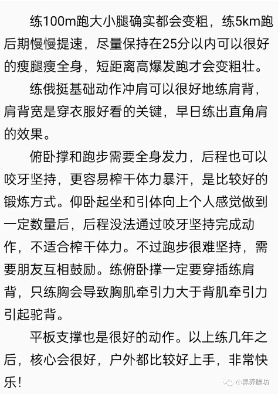

**一年的总结，以及未来的展望**

本来计划回家之后也能有一定的时间写论文，曾经计划在所里待一段时间再回家。可惜，计划赶不上变化，疫情的原因导致我必须要早点回家，回了家之后发现自己也没有精力去每天写论文，现在寄希望于可以早点回所去写论文。虽然这是最后一个假期，但是假期还是有事情的感觉真的特别不好，尽管我知道，这是一直以来自己的一个问题，一旦最近有一个事情，就静不下心去做，而且也不敢去玩，去做别的事情，导致自己很焦虑还得不到放松。

最近在读的一本书是《利用好每天的两小时》，里面有很多的案例告诉我，有时候不敢开始做一件事情的原因是，准备的时间太多了，在做这件事之前花了很大的精力去做其他无关的事情，所以，可能能治好我的方法就是提前计划好先做最重要的事情。**新的一年，希望每一天的计划，可以帮助我养成这个习惯：先做计划好的最重要的事情。**

回家后效率低下的另一个原因就是，自己总是想去做别的事情，比如说改善体态、学习做视频，或者其他的任何事情，回家之后总是想放松，连睡眠时间也变多了，去年是非常匆忙的一年，但是如果不能打理好自己的事情，管理好自己的时间，以后自己只会越来越忙。我觉得自己新年还是要**多多注意自己应该做好的事情，计划好的事情就要按时完成，该拒绝的时候就应该拒绝。**

体态其实是我健身的第一目的，但是健身起来的时候，大重量，腹肌，胸肌，或者傲人的运动表现却蒙蔽了双眼，很久没有这样去思考自己运动的目的了，我其实只是想多出点汗，提高自己在工作中的效率和表现，当然希望长时间的久坐和工作不会让自己的身体出大问题。虽然健身房很多运动达人他们也能在使用大重量的同时做到体态的良好和稳定，但是我想那不是我运动的初心。细细回想，第一个月控制饮食和每天波比跳也只是希望自己能瘦下来不要那么胖就可以了，后面俯卧撑，引体向上和深蹲也只是完成自己运动的一个方式，我希望自己能达到初高中体育考试的运动水平和运动能力，即使以后去健身房，这些训练可能还是我最主导的训练。保持体重和体脂则必须要自己能控制住饮食，而它其实可能只是这些训练和生活习惯的一个结果而已。**新的一年，希望不忘初心，努力锻炼，努力训练，控制饮食，改善体态。**

生活中总是有困难和困苦，也总是会有自己不如意的事情，但是正所谓，己所不欲勿施于人，要学习理解别人，理解别人的语言和行为，也要理解自己，不要逼迫自己，给自己一定的时间和空间。非暴力沟通，尝试理解别人，也尝试让自己退一步去思考问题。

我不希望自己以后就没有了朋友，也不愿意丢弃之前的朋友，我才发现，一段单纯的，没有杂念的友谊是多么不容易。

2021年，或者说我的本命年的确不好过，很累，也很匆忙，回过头去想想，很多事情都是自己没有规划好才这样的。2022年希望我可以养成自己的习惯，懂得去关心一段关系，爱护身体，也保护自己的精力和意志力。

这段年终总结不算沮丧，还算喜悦，因为青春似乎要结束了，我好像能在被生活重锤后，重新站起来了。