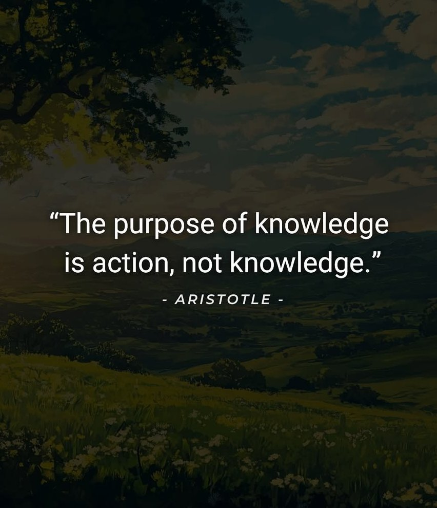

# 做点事情

学生生涯的最后期创建了这个文件夹，最近读了很多优秀的博客，记录了自己学习的历程，萌生了创建自己仓库的想法。

之前读论文的时候还喜欢做[纸质笔记](./Archive/README.md)，那段时间感觉自己对那个子领域的知识是成体系的。做工作时间久了，没有精力去阅读文献，深感对于很多论文的记忆只剩下一两个经常使用的结论。还需要做什么，能做什么，对这个领域不属于也不了解。觉得这样不行。建立这个仓库，总结一些自己读过的论文。将来如果还能做与科研或者技术相关的内容的话，希望能一直坚持下去吧。

无论如何，都要去做。🏃🏋️‍♂️🧗🎯🆙

—— 2025.01.24

在探索工作时，增添了无数的迷茫和焦虑。找到自己喜欢的东西，然后一直从事并坚持下去。曾经的理想偶尔能想起来，没有任何动力继续下去，如何朝着曾经的目的地继续前进，或者再更换一下目标？

—— 2025.02.12

```shell
Do it anyway
People are often unreasonable, irrational, and self-centered.     
Forgive them anyway.     
If you are kind, people may accuse you of selfish, ulterior motives.     
Be kind anyway.     
If you are successful, you will win some false friends and some true enemies.     
Succeed anyway.     
If you are honest and frank, people may cheat you.     
Be honest and frank anyway.     
What you spend years building, others could destroy overnight.     
Build anyway.     
If you find serenity and happiness, some may be jealous.     
Be happy anyway.     
The good you do today, will often be forgotten.     
Do good anyway.     
Give the world the best you have, and it may never be enough.     
Give your best anyway.     
You see, in the final analysis, it is between you and God.     
It was never between you and them anyway.     
So do it anyway.
```
