# Static Program Analysis - Data Flow Analysis - Foundations

## Iterative Algorithm, Another View

This general iterative algorithm produces a solution to data flow analysis.

### Iterative Algorithm for May & Forward Analysis

**INPUT:** CFG ($kill_B$ and $gen_B$ computed for each basic block B)
**OUTPUT:** IN[B] and OUT[B] for each basic block B
**METHOD:** 

```java
OUT[entry] = ⌀;
for (each basic block B\entry)
    OUT[B] = ⌀;
while (changes to any OUT occur)
    for (each basic block B\entry) {
        IN[B] = ⋃ _ {P a predecessor of B} OUT[P];
        OUT[B] = gen_B ⋃ (IN[B] - kill_B)
    }
```

### View Iterative Algorithm in Another Way

**文字描述版**

- Given a CFG (program) with **k** nodes, the iterative algorithm updates OUT[n] for every node n in each iteration.
- Assume the domain of the values in data flow analysis is V, then we can define a k-tuple $(OUT[n_1], OUT[n_2], ..., OUT[n_k])$ as an element of set $(V_1 * V_2 * ... * V_k)$ denoted as $V^k$, to hold the values of the analysis after each iteration.
- Each iteration can be considered as taking an action to map an element of $V^k$, through applying the transfer functions and control-flow handling, abstracted as a function $F: V^k → V^k$
- Then the algorithm outputs a series of k-tuples iteratively until a k-tuple is the same as the last one in two consecutive iterations. 

**图示版**

Each iteration takes an action $F: V^k → V^k$

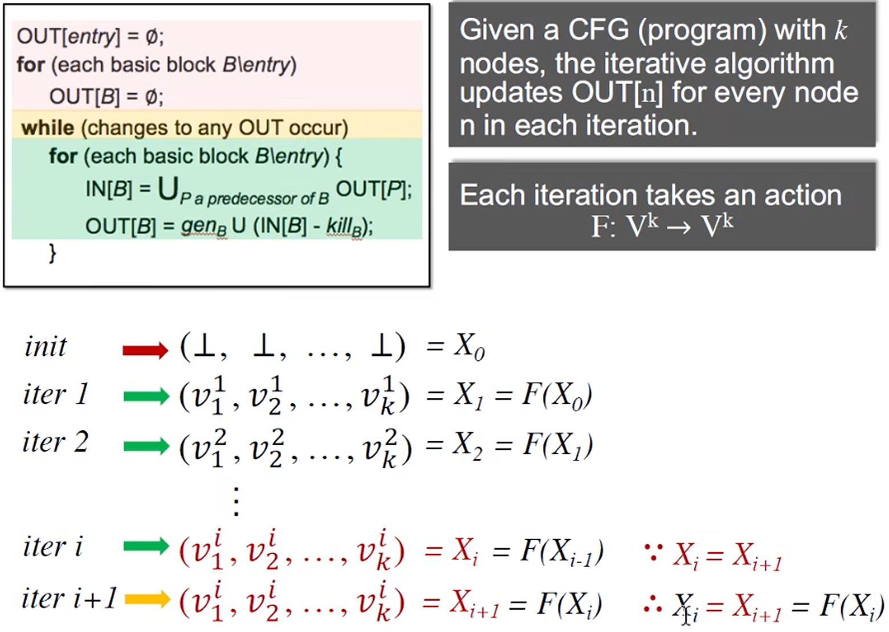

- 初始化的每一个 out 初始化为 空 ⊥
- 迭代至，某一次的结果与上一次迭代的结果相同
- $X_i = X_{i+1} = F(X_i)$ 其中 X is a **fixed point** of function F if $X = F(X)$ 不动点
- 在达到不动点时，即 The iterative algorithm reaches **a fixed point**

**The iterative algorithm (or the IN/OUT equation system) produces a solution to a data flow analysis:**

- Is the algorithm guaranteed to terminate or reach the fixed point, or does it always have a solution?
- If so, is there only one solution or only one fixed point? If more than one, is our solution the best one (most precise)?
- When will the algorithm reach the fixed point, or when can we get the solution?

## Math Foundations

### Partial Order 偏序集 

We define **poset** as a pair (P, ⊑) where **⊑** is a binary relation that defines a **partial ordering** over P, and ⊑ has the following properties:

(1) ∀ x ∈ P, x ⊑ x                      (Reflexivity 自反性)
(2) ∀ x, y ∈ P, x ⊑ y ∧ y ⊑ x ⇒ x = y   (Antisymmtry 反对称性)
(3) ∀ x, y, z ∈ P, x ⊑ y ∧ y ⊑ z ⇒ x ⊑ z

**Example 1.** Is (S, ⊑) a poset where S is a set of integers and ⊑ represents ≤ (less than or equal to)?

(1) Reflexivity 1 ≤ 1, 2 ≤ 2                ✅
(2) Antisymmtry x ≤ y ∧ y ≤ x then x = y    ✅
(3) Transitivity 1 ≤ 2 ∧ 2 ≤ 3 then 1 ≤ 3   ✅

因此是偏序集

**Example 2.** Is (S, ⊑) a poset where S is a set of integers and ⊑ represents ＜ (less than)?

(1) Reflexivity 1 ＜ 1, 2 ＜ 2                ❎  因此不是偏序集

**Example 3.** Is (S, ⊑) a poset where S is a set of English words and ⊑ represents the substring relation, i.e., s1 ⊑ s2 means s1 is substring of s2? 均满足，也是同样的属性

**如何理解偏序？** **partial** means for a pair of set elements in P, they could be **incomparable;** in other words, not necessary that every pair of set elements must satisfy the ordering ⊑   即并非每两个元素不一定有偏序关系

> partial 的含义可以理解为：incomparable 

**Example 4.** Is (S, ⊑) a poset where S is the power set of set {a, b, c} and ⊑ represents ⊆ (subset)?

幂集的概念，也是满足的。

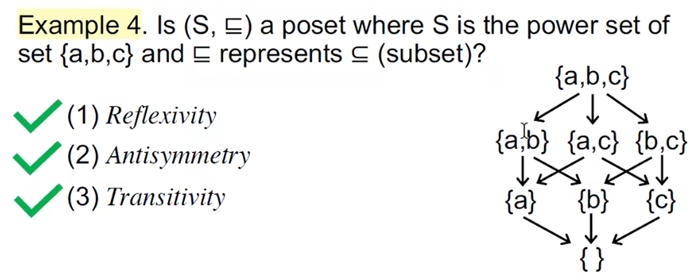

### Upper and Lower Bounds 

Given a poset (P, ⊑) and its subset S that S ⊆ P, we say that u ∈ P is an *upper bound* of S, if ∀ x ∈ S, x ⊑ u. Similarly, l ∈ P is a *lower bound* of S, if ∀ x ∈ S, l ⊑ x.

在下图中，灰色部分的 upper bound 和 lower bound 分别是什么？

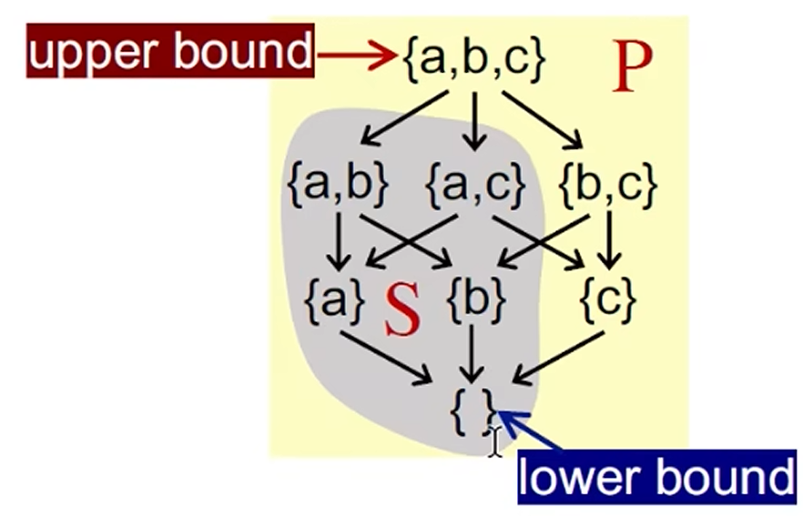

We define the *least upper bound* (lub or join) of S, written ⨆S, if for every upper bound of S, say u, ⨆S ⊑ u. Similarly, we define the *greast lower bound* (glb or meet) of S, written ⨅S, if for every lower bound of S, say l, l ⊑ ⨅S.

<u>upper bound和lower bound可能存在多个</u>

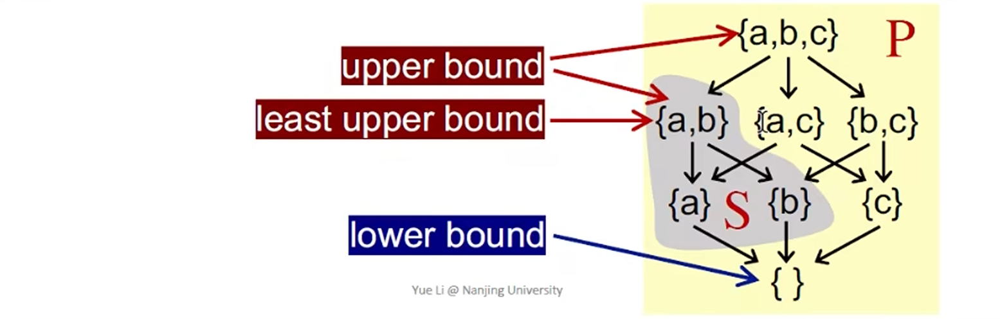

Usually, if S contains only two elements a and b (S = {a, b}), then 

- ⨆S can be written a ⨆ b (the *join* of a and b)
- ⨅S can be wtitten a ⨅ b (the *meet* of a and b)

### Some properties 

- Not every poset has *lub* or *glb*

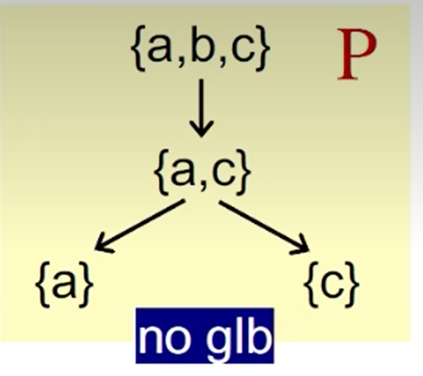

- But if a poset has *lub* or *glb*, it will be unique

*Proof.*

assume $g_1$ and $g_2$ are both glbs of poset P, according to the definition of glb, thus: $g_1$ ⊑ ($g_2$ = ⨅P) and $g_2$ ⊑ ($g_1$ = ⨅P) by the antisymmetry of partial order ⊑, thus $g_1$ = $g_2$

## Lattice, Semilattice, Complete and Product Lattice

### Lattice 格

Given a poset (P, ⊑), ∀ a, b ∈ P, if a ⨆ b and a ⨅ b exist, then (P, ⊑) is called a lattice.

> A poset is a lattice if **every pair** of its elements has a least upper bound and a greatest lower bound?

**Example 1.** Is (S, ⊑) a lattice where S is a set of integers and ⊑ represents ≤ (less than or equal to)?

The ⨆ operator means "max" and ⨅ operator means "min". YES

**Example 2.** Is (S, ⊑) a lattice where S is a set of English words and ⊑ represents the substring relation, i.e., s1 ⊑ s2 means s1 is substring of s2?

NO. pin ⨆ sin = ? 这个没有上界，因此一定不是

**Example 3.** Is (S, ⊑) a lattice where S is the power set of set {a, b, c} and ⊑ represents ⊆ (subset)?

The ⨆ operator means ∪ and ⨅ operator means ∩. YES

### Semilattice

Given a poset (P, ⊑), ∀ a, b ∈ P, if only a ⨆ b exists, then (P, ⊑) is called a join semilattice; if only a ⨅ b exists, then (P, ⊑) is called a meet semilattice.

### Complete Lattice 

Given a lattice (P, ⊑), for arbitrary subset S of P, if ⨆S and ⨅S exist, then (P, ⊑) is called a complete lattice.

**All subsets** of a lattice have a least upper bound and a greatest lower bound.

**Example 1.** Is (S, ⊑) a complete lattice where S is a set of integers and ⊑ represents ≤ (less than or equal to)?

For a subset $S^+$ including all positive integers, it has no ⨆$S^+$ (+∞)，因此不是

**Example 2.** Is (S, ⊑) a complete lattice where S is the power set of set {a, b, c} and ⊑ represents ⊆ (subset)?

**Note:** the definition of bounds implies that the bounds are not necessarily in the subsets (but they must be in the lattice). 边界不一定在子集中，但是一定需要在 lattice 中

Every complete lattice (P, ⊑) has 

- a **greatest** element ⊺ = ⨆P called **top** and
- a **least** element ⊥ = ⨅P called **bottom**

Every **finite** lattice (P is finite) is a complete lattice.

一般情况下 complete lattice 都是 **有穷** 的，用于数据流分析

### Product Lattice

Given lattices $L_1=(P_1,⊑_1)$, $L_2=(P_2,⊑_2)$, ..., $L_n=(P_n,⊑_n)$, if for all i, $(P_i,⊑_i)$ has $⨆_i$ (least upper bound) and $⨅_i$ (greatest lower bound), then we can have a **product lattice** $L^n=(P, ⊑)$ that is defined by:

- $P=P_1 * ... * P_n$
- $(x_1,...,x_n)$ ⊑ $(y_1,...,y_n)$ ⇔ $(x_1⊑y_1)$ ∧ ... ∧ $(x_n⊑y_n)$
- $(x_1,...,x_n)$ ⨆ $(y_1,...,y_n)$ = ($(x_1 ⨆_1 y_1)$, ..., $(x_n ⨆_n y_n)$)
- $(x_1,...,x_n)$ ⨅ $(y_1,...,y_n)$ = ($(x_1 ⨅_1 y_1)$, ..., $(x_n ⨅_n y_n)$)

**两个性质**

- A product lattice is a lattice
- If a product lattice L is a product of complete lattices, then L is also complete

## Data Flow Analysis Framework via Lattice

A data flow analysis framework (D, L, F) consists of:

- **D:** a direction of data flow: forwards or backwards
- **L:** a lattice including domain of the values V and a meet ⨅ (intersection) or join ⨆ (union) operator
- **F:** a family of transfer functions from V to V

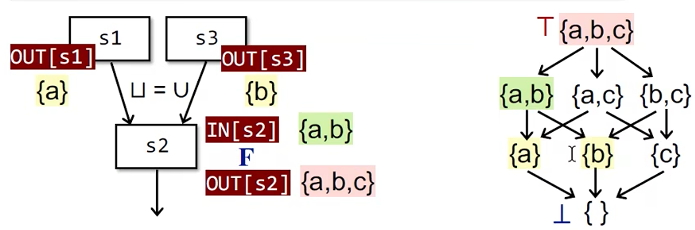

Data flow analysis can be seen iteratively applying transfer functions and meet/join operations on the values of a lattice.

### Review above questions

- Is the algorithm guaranteed to terminate or reach the fixed point, or does it always have a solution?
  - Recall `OUT never shrinks`. It is about monotonicity.
- If so, is there only one solution or only one fixed point? If more than one, is our solution the best one (most precise)?
  - 可以，$f(x)=x^2$，就有两个0 和 1，因此是一定有的
  - 那么是不是最好的呢？是的，要么是 greatest fixed point，要么是 least fixed point

## Monotonicity and Fixed Point Theorem

**Monotonicity**

A function f: L → L (L is a lattice) is monotonic if ∀ x, y ∈ L, x ⊑ y ⇒ f(x) ⊑ f(y)

**Fixed-Point Theorem**

Given a complete lattice (L, ⊑), if: (1) f: L → L is monotonic and (2) L is finite, then 

- the **least fixed point** of f can be found by iterating $f(⊥), f(f(⊥)), ..., f^k(⊥)$ until a fixed point is reached.
- the **greatest fixed point** of f can be found by iterating $f(⊺), f(f(⊺)), ..., f^k(⊺)$ until a fixed point is reached.

### Fixed-Point Theorem (Existence of Fixed Point)

*Proof:*

By the definition of ⊥ and f: L → L, we have: ⊥ ⊑ f(⊥)

As f is monotonic, we have: f(⊥) ⊑ f(f(⊥)) = $f^2(⊥)$

Similarly (by repeated applying f), we have:

⊥ ⊑ f(⊥) ⊑ $f^2(⊥)$ ⊑ ... ⊑ $f^i(⊥)$

As L is finite, for some k, we have: $f^{Fix} = f^k(⊥) = f^{k+1}(⊥)$

Thus, the fixed point exists.

### Fixed-Point Theorem (Least Fixed Point)

*Proof:*

Assume we have another fixed point x, i.e., x = f(x) 

By the definition of ⊥, we have ⊥ ⊑ x

Induction begins: 数学归纳法

As f is monotonic, we have f(⊥) ⊑ f(x)

Assume $f^i(⊥) ⊑ f^i (x)$, as f is monotonic, we have: $f^{i+1}(⊥) ⊑ f^{i+1} (x)$

Thus by induction, we have $f^{i}(⊥) ⊑ f^{i} (x) = x$, then we have: $f_{Fix} = f^k(⊥) ⊑ x$

Thus the fixed point is the least.

**Now** what we have just seen is the property (fixed point theorem) for the function on a lattice. We cannot say our iterative algorithm also has that property unless we can *relate the algorithm to the fixed point theorem*, if possible.

## Relate Iterative Algorithm to Fixed Point Theorem (偏向于直观的描述)

1. 首先，可以发现每一个L都是 complete 且 finite 的 lattice ，因此得到的 product lattice也是 complete 且 finite 的
2. 另外，可以把每一次转换看作是两个流程之间采用了 Transfer Function，并且应用了 meet 或者 join 的操作
3. 接下来，需要证明 Now the remaining issue is to prove the **function F** is monotonic

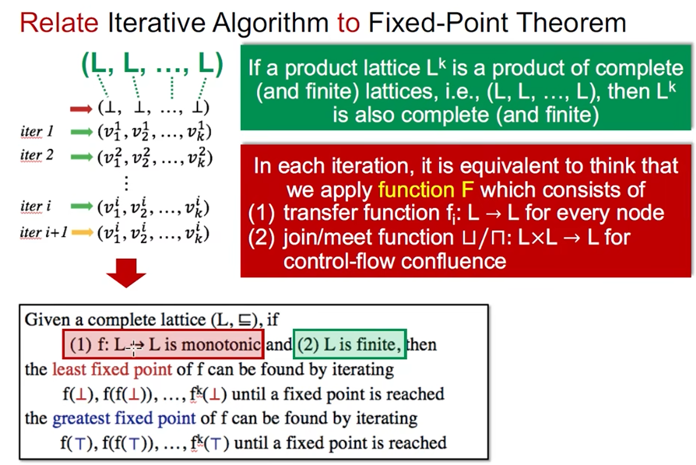

### Prove Function F is Monotonic 

In each iteration, it is equivalent to think that we apply function F which consists of:

(1) transfer function $f_i: L → L$ for every node
   - 有提到过所有的 Never shrinks ，所有的 Transfer Function 都是 monotonic; Gen/Kill function is monotonic 

(2) join/meet function $⨆/⨅: L * L → L$ for control-flow confluence
   - Actually the binary operator is a basic case of L * L * ... * L ，因此只需要证明 basic case 是单调即可

**证明 ⨆ 是单调的**

∀ x, y, z ∈ L, x ⊑ y, we wan to prove x ⨆ z ⊑ y ⨆ z

by the definition of ⨆, y ⊑ y ⨆ z

by transitivity of ⊑, x ⊑ y ⨆ z

thus y ⨆ z is an upper bound for x, and also for z (by ⨆'s definition)

as x ⨆ z is the least upper bound of x and z 

thus x ⨆ z ⊑ y ⨆ z

**Thus the fixed point theorem applies to the iterative algorithm for data flow analysis**

Now what we have just seen is the property (fixed point theorem) for the function on a lattice. We can *relate the algorithm to the fixed point theorem*.

### When Will the Algorithm Reach the Fixed Point?

The **height of a lattice h** is the length of the longest path from Top to Bottom in the lattice.

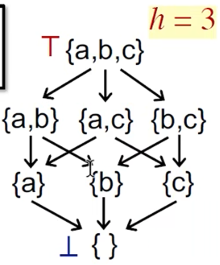

希望求取：The maximum iterations **i** needed to reach the fixed point.

预设条件：In each iteration, assume only **one step in the lattice** (upwards or downwards) is made in **one node** (e.g., one 0 → 1 in RD)

Assume the lattice height is h and the number of nodes in CFG is k.

**Result:** We need at most $i=h*k$ iterations.

**Problem 3:** When will the algorithm reach the fixed point, or when can we get the solution? 
- Worst case of #iterations: the product of the lattice height and the number of nodes in CFG

## May/Must Analysis, A Lattice View (这个部分可以总结前述的内容)

无论是 May Analysis 还是 Must Analysis，都是从 unsafe result 向 safe result 转变，而且都是从 Precise 向 Less Precise 转变

May Analysis 以 Reaching Definitions 举例，以查错为目标，在 Bottom 和 Top 之间存在一个 Truth，进而分割了 Safe 和 Unsafe 的边界

Must Analysis 是以优化作为目标

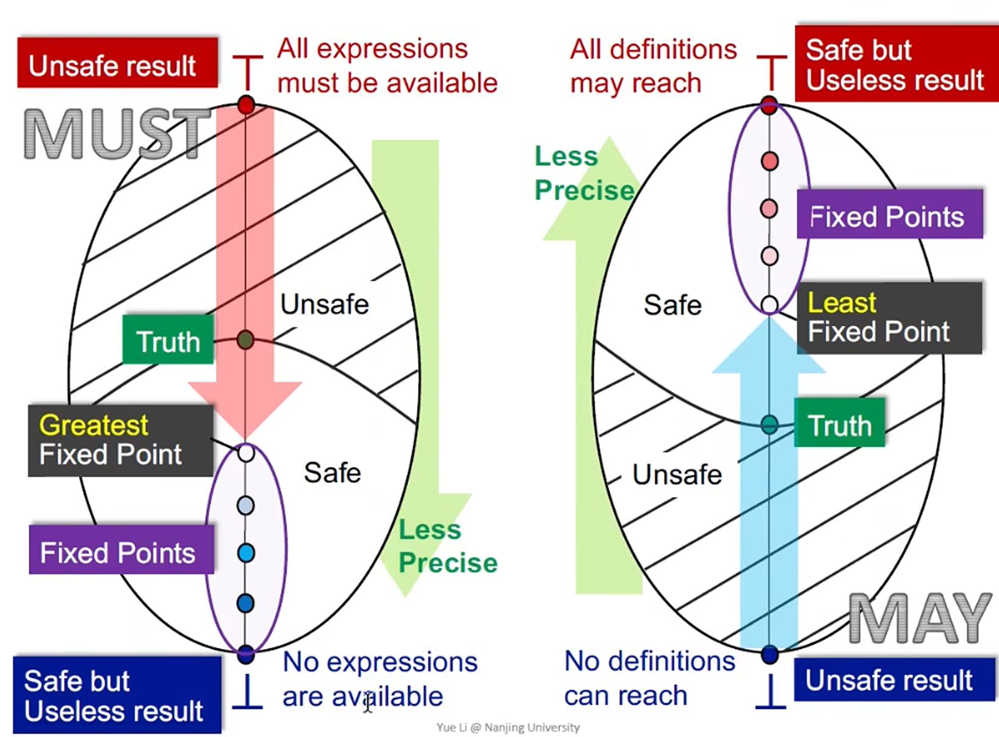

**Another view to explain greatest/least fixed point? (minimal step by meet/join)**

May Analysis 本身是取得最小的上界，与前面的一小步一小步执行是同理的

Least Upper Bound 也就是我们能找到的最小的 Fixed Point.

## Distributivity and MOP

### How Precise Is Our Solution?

**Meet-Over-All-Paths Solution (MOP)**

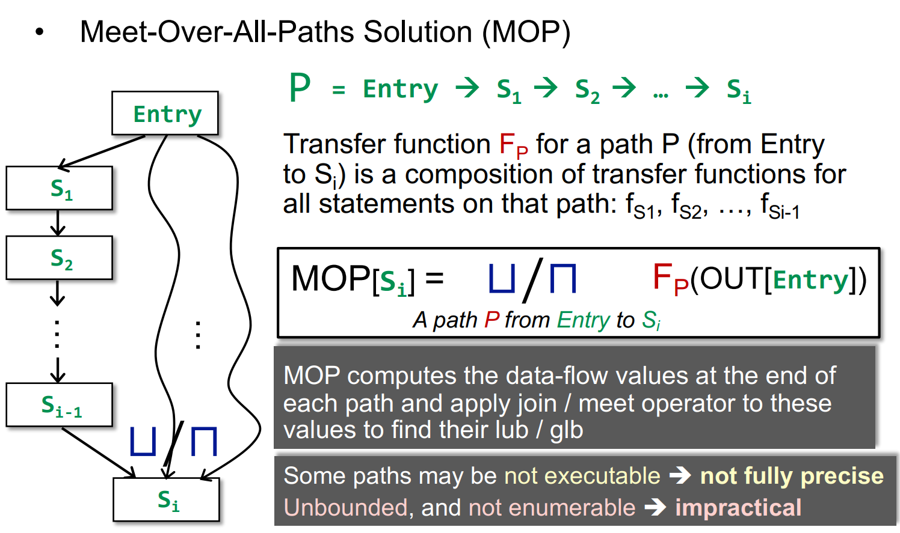

MOP computes the data-flow values at the end of each path and apply join / meet operator to these values to find their lub / glb

- Some paths may be **not executable** 👉 **not fully precise**
- **Unbounded,** and **not enumerable** 👉 **impractical**

### Ours (Iterative Algorithm) vs. MOP 

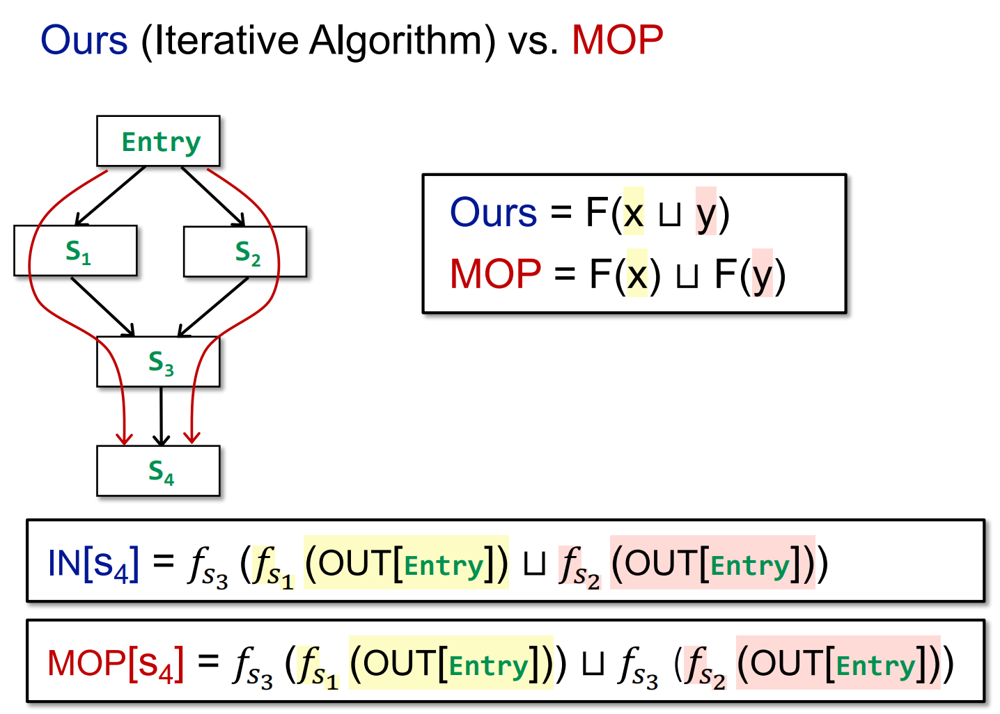

**Ours 和 MOP 之间存在什么区别或联系？**

- Ours = F(x ⨆ y)
- MOP = F(x) ⨆ F(y)

<u>构造关系</u>

By definition of lub ⨆, we have: x ⊑ x ⨆ y and y ⊑ x ⨆ y

As transfer function **F is monotonic**, we have: F(x) ⊑ F(x ⨆ y) and F(y) ⊑ F(x ⨆ y)

That means F(x ⨆ y) is an upper bound of F(x) and F(y)

As F(x) ⨆ F(y) is the lub of F(x) and F(y), we have F(x) ⨆ F(y), we have: 

- F(x) ⨆ F(y) ⊑ F(x ⨆ y)
- MOP ⊑ Ours

**Ours is less precise than MOP.**

When **F is distributive,** i.e.,

- F(x) ⨆ F(y) = F(x ⨆ y)
- MOP = Ours

**(Ours is as precise as MOP)**

Bit-vector or Gen/Kill problems (set union / intersection for join / meet) are distributive.

## Constant Propagation

> 不满足 `distributive` 性质

Given a variable x at program point, determine whether x is **guaranteed** to hold a constant value at p.  **must analysis**，但是和传统的 must analysis 不太一样

- The OUT of each node in CFG, includes a set of pairs (x, v) where x is a variable and v is the value held by x after that node
- A data flow analysis framework (D, L, F) consists of:
  - D: a **direction** of data flow: forwards or backwards   👉   Forward
  - L: a **lattice** including domain of the values V and a meet ⨅ or join ⨆ operator
  - F: a family of **transfer functions** from V to V

### Constant Propagation - Lattice

**Domain of the values V**

NAC = Not any Constant 即整个程序没有任何一个常量，即所有的都不进行优化，即是USELESS

UNDEF 如果按照常规考虑，是所有的都是常量，但是由于是通过pair的方式表示，程序初始化不知道值是什么，因此初始化为 `UNDEF`

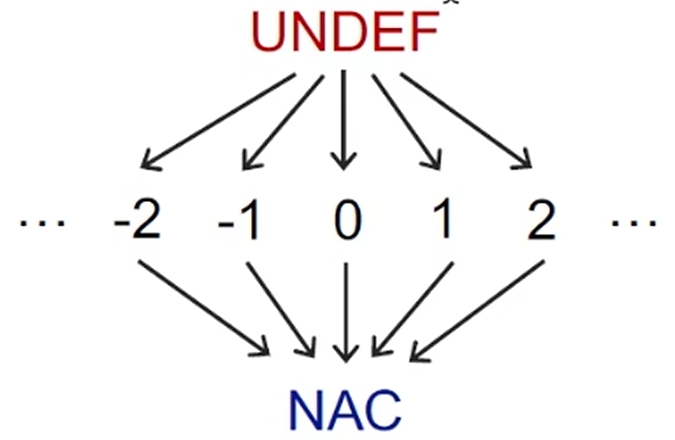

**Meet Operator ⨅**

NAC ⨅ v = NAC  因为是safe，因此一定

UNDEF ⨅ v = v 即进行了赋值的操作。

值得注意的是：**Uninitialized variables are not the focus in our constant propagation analysis**

c ⨅ v = ?  需要分为两种情况
- c ⨅ c = c
- $c_1$ ⨅ $c_2$ = NAC

At each path confluence (路径汇合) PC, we should apply `meet` for all variables in the incoming data-flow values at that PC.

### Constant Propagation - Transfer Function

Given a statement s: x = ..., we define its transfer function F as: **F:** OUT[s] = gen ∪ (IN[s] - {(x, _)})

_ 表示 x 原来所有的值都会被干掉，因为 x 被重新赋值

(we use val(x) to denote the lattice value that variable x holds)

```java
- s: x=c; // c is a constant 👉 gen = {(x, c)}
- s: x=y; // 👉 gen = {(x, val(y))}
- s: x=y op z; // gen = {(x, f(y, z))}

f(y, z) = 
- val(y) op val(z) // if val(y) and val(z) are constants
- NAC // if val(y) or val(z) is NAC
- UNDEF // otherwise
```

undefine在L里是top，其他常量≤undef，若undef的一个函数输出是常量，则这个常量可能小于其他常量的函数的输出结果，导致gen(undef)≤gen(c) 不满足单调性

if **s** is not an assignment statement, **F** is the identity function.

### Constant Propagation - Nondistributivity

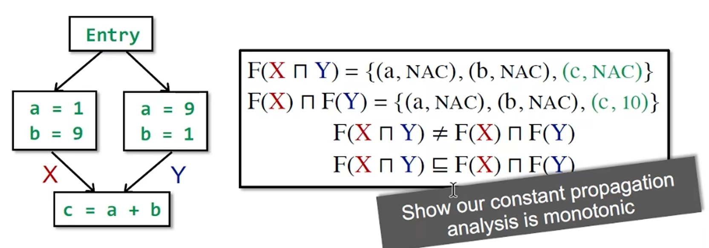

F(X ⨅ Y) 在更下面的位置，因此是上述的关系

## Worklist Algorithm

Worklist Algorithm, an optimization of Iterative Algorithm

**OUT will not change if IN does not change.**

```java
OUT[entry] = ⌀;

for (each basic block B\entry)
  OUT[B] = ⌀;

Worklist ← all basic blocks

while (Worklist is not empty) 
  Pick a basic block B from Worklist
  old_OUT = OUT[B]
  IN[B] = ⨆ _ {P a predecessor of B} OUT[P];
  OUT[B] = gen_B ∪ (IN[B] - kill_B);

  if (old_OUT ≠ OUT[B]) 
    Add all successors of B to Worklist
```

## Problem

- Understand the functional view of iterative algotrithm
- The definitions of lattice and complete lattice
- Understand the fixed-point theorem
- How to summarize may and must analyses in lattices
- The relation between MOP and the solution produced by the iterative algorithm
- Constant propagation analysis
- Worklist algorithm