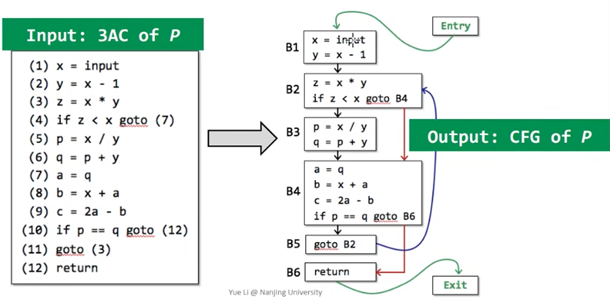
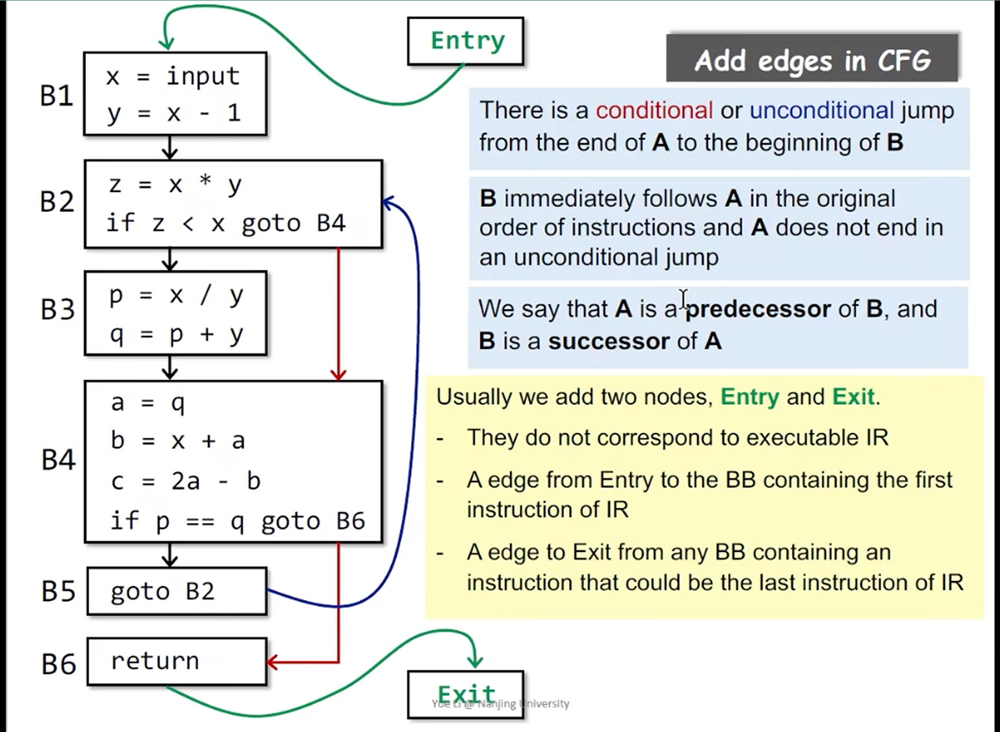

# Static Program Analysis - Intermediate Representation (IR)

## Compilers and Static Analyzers 

### Compiler 

```shell
Source Code
👇
Scanner: Lexical Analysis 词法分析 (利用正则表达式 Regular Expression)
👇 如果通过词法分析，每个单词都会构成Tokens
Parser: Syntax Analysis 语法分析 (利用上下文无关文法 Context-Free Grammar)
👇 如果通过语法分析，会形成抽象语法树 AST
Type Checker: Semantic Analysis 语义分析 (利用属性语法 Attribute Grammar)
👇 如果通过语义分析，会生成 Decorated AST 
Translator
👇 通过转换器转换程IR，通常指三地址码 
Code Generator 继续把三地址码生成Machine code
👇
Machine Code
```

上述 IR ，是 Static Analysis 非常重要的，例如进行 code optimization ，甚至是安全漏洞，也需要进行上述步骤直到得到一个合法的 IR 

## AST vs. IR

`do i=i+1; while (a[i]<v);`

**AST:** 抽象语法树

- high-level and closed to grammar structure
- usually language dependent
- suitable for fast type checking
- lack of control flow information 

**IR: (3-address form)**

- low-level and closed to machine code 
- usually language independent
- compact and uniform
- contains control flow information 
- **usually considered as the basis for static analysis**

```python
1: i = i+1
2: t1 = a[i]
3: if t1 < v goto 1
```


## IR: Three-Address Code (3AC)

**There is at most one operator on the right side of an instruction.** 转化通常需要引入临时变量

```python 
t2 = a + b + 3
👇
t1 = a + b 
t2 = t1 + 3
```

### Why called 3-address?

Each 3AC contains at most 3 addresses. **Address** can be one of the following:

- Name: a, b
- Constant: 3
- Compiler-generated temporary: t1, t2 

Each type of instructions has its own 3AC form.

### Some Common 3AC Forms

```python
x = y bop z 
x = uop y 
x = y
goto L 
if x goto L
if x rop y goto L
```

**x, y, z: addresses**

- bop: binary arithmetic or logical operation
- uop: unary operation (minus 负数, negation 取反, casting 类型转换) 
- L: a label to represent a program location 
- rop: relational operator (>, <, ==, >=, <=, etc.)
- goto L: unconditional jump
- if ... goto L: conditional jump 

## 3AC in Real Static Analyzer: Soot 

3AC in real-world complicated forms

### Soot and Its IR: Jimple

Soot: Most popular static analysis framework for Java 

https://github.com/Sable/soot
https://github.com/Sable/soot/wiki/Tutorials

Soot's IR is Jimple: **typed** 3-address code 

**Example 1: For Loop**

源代码

```java
package nju.sa.examples;
public class ForLoop3AC {
    public static void main(String[] args) {
        int x = 0;
        for (int i = 0; i < 10; i++) {
            x = x + 1;
        }
    }
}
```
三地址码

```java
public static void main(java.lang.String[]) {
    java.lang.String[] r0;
    int i1;

    r0 := @parameter0: java.lang.String[];
    i1 = 0;

label1:
    if i1 >= 10 goto label2;
    i1 = i1 + 1;
    goto label1;

label2:
    return;
}
```
**Example 2: Do-While Loop**

源代码

```java
package nju.sa.examples;
public class DoWhileLoop3AC {
    public static void main(String[] args) {
        int [] arr = new int[10];
        int i = 0;
        do {
            i = i + 1;
        } while (arr[i] < 10);
    }
}
```

三地址码

```java
public static void main(java.lang.String[]) {
    java.lang.String[] r0;
    int[] r1;
    int $i0, i1;

    r0 := @parameter0: java.lang.String[];
    r1 = newarray (int)[10];

    i1 = 0;

label1:
    i1 = i1 + 1;
    $i0 = r1[i1];
    if $i0 < 10 goto label1;
    
    return;
}
```

**Example 3: Method Call**

源代码

```java
package nju.sa.examples;
public class MethodCall3AC {

    String foo (String para1, String para2) {
        return para1 + " " + para2;
    }

    public static void main(String[] args) {
        MethodCall3AC mc = new MethodCall3AC();
        String result = mc.foo("hello", "world");
    }
}
```

三地址码

```java
java.lang.String foo (java.lang.String, java.lang.String) {
    nju.sa.examples.MethodCall3AC r0;
    java.lang.String r1, r2, $r7;
    java.lang.StringBuilder $r3, $r4, $r5, $r6;

    r0 := @this: nju.sa.examples.MethodCall3AC;
    r1 := @parameter0: java.lang.String;
    r2 := @parameter1: java.lang.String;
    $r3 = new java.lang.StringBuilder;

    specialinvoke $r3.<java.lang.StringBuilder: void <init>()>();

    $r4 = virtualinvoke $r3.<java.lang.StringBuilder: java.lang.StringBuilder append(java.lang.String)>(r1);
    $r5 = virtualinvoke $r4.<java.lang.StringBuilder: java.lang.StringBuilder append(java.lang.String)>(" ");
    $r6 = virtualinvoke $r5.<java.lang.StringBuilder: java.lang.StringBuilder append(java.lang.String)>(r2);
    $r7 = virtualinvoke $r6.<java.lang.StringBuilder: java.lang.String toString()>();

    return $r7;
}

public static void main (java.lang.String[]) {
    java.lang.String[] r0;
    nju.sa.examples.MethodCall3AC $r3;

    r0 := @parameter0: java.lang.String[];

    $r3 = new nju.sa.examples.MethodCall3AC;

    specialinvoke $r3.<nju.sa.examples.MethodCall3AC: void <init>()>();

    virtualinvoke $r3.<nju.sa.examples.MethodCall3AC: java.lang.String foo(java.lang.String, java.lang.String)>("hello", "world");

    return;
}
```

**JVM中主要的四种方法调用**

- invokespecial: call constructor, call superclass methods, call private methods
- invokevirtual: instance methods call (virtual dispatch) 常用的方法调用
- invokeinterface: cannot optimization, checking interface implementation 
- invokestatic: call static methods 

Java 7 之后还引入：

- invokedynamic 👉 原本 Java static typing, 需要 dynamic language runs on JVM

**<>中内容称为Method的Signature:** method signature 通常包括：

- class name:
  - return type method name (parameter1 type, parameter2 type, ...)


**Example 4: Class**

源代码

```java
package nju.sa.examples;
public class Class3AC {
    public static final double pi = 3.14;
    public static void main(String[] args) {}
}
```

三地址码

```java
public class nju.sa.examples.Class3AC extends java.lang.Object {
    public static final double pi;
    
    public void <init>() {
        nju.sa.examples.Class3AC r0;
        r0 := @this: nju.sa.examples.Class3AC;
        specialinvoke 30.<java.lang.Object: void <init>()>();
        return;
    }

    public static void main (java.lang.String[]) {
        java.lang.String[] r0;
        r0 := @parameter0: java.lang.String[];
        return ;
    }
    // 类的静态初始化函数
    // 引用一个变量的时候，会把这个变量加载进来
    public static void <clinit>() {
        <nju.sa.examples.Class3AC: double pi> = 3.14;
        return;
    }
}
```

`clinit` 的例子：在使用该类的时候，就会把这个静态变量初始化进来

## Static Single Assignment (SSA)

All assignments in SSA are to variables with distinct names

- Give each definition a fresh name
- Propagate fresh name to subsequent uses
- Every variable has exactly one definition
  - What if a variable use is at control flow merges?
    - A special merge operator, Φ (called phi-function), is introduced to select the values at merge nodes 
    - Φ(x_0, x_1) has the value x_0 if the control flow passes through the true part of the conditional and the value x_1 otherwise

**3AC 三地址码**

```java
p = a + b
q = p - c
p = q * d
p = e - p
q = p + q
```

**SSA**

```java
p_1 = a + b
q_1 = p_1 - c
p_2 = q_1 * d
p_3 = e - p_2
q_2 = p_3 + q_1
```

### Why SSA?

- Flow information is indirectly incorporated into the unique variable names
  - May help deliver some simpler analyses, e.g., flow-insensitive analysis gains partial precision of flow sensitive analysis via SSA
- Define-and-Use pairs are explicit
  - Enable more effective data facts storage and propagation in some on-demand tasks 
  - Some optimization tasks perform better on SSA (e.g., conditional constant propagation, global value numbering)

### Why not SSA?

- SSA may introduce too many variables and phi-functions
- May introduce inefficiency problem when translating to machine code (due to copy operations) 因为还要翻译成机器码，因此会产生一定的问题

## Control Flow Analysis

- Usually refer to building Control Flow Graph (CFG)
- CFG serves as the basic structure for static analysis
- The node in CFG can be an individual 3-address instruction, or (usually) a Basic Block



### Basic Blocks (BB)

Basic blocks (BB) are **maximal** sequences of consecutive three-address instructions with the properties that:

- It can be entered only at the begining, i.e., the first instruction in the block.
- It can be exited only at the end, i.e., the last instruction in the block 


**Try to design the algorithm to build BBs by yourself. 初始自己的想法**

```java
// 自然入口
(1)  x = input 
(2)  y = x - 1
// 自然出口

// (11) 那里 go to (3) 这里有一个入口
(3)  z = x * y
(4)  if z < x goto (7)
// go to (7) 代表这里 (7) 是出口

// 自然入口
(5)  p = x / y
(6)  q = p + y
// 自然出口

// 因此这里 (7) 是一个入口
(7)  a = q 
(8)  b = x + a
(9)  c = 2a - b
(10) if p == q goto (12)
// goto (12) 是一个出口

// goto (3) 因此是一个出口，也是一个入口
(11) goto (3)

// 自然入口和出口
(12) return 
```

#### How to build Basic Blocks 

**INPUT:** A sequence of three-address instructions of P

**OUTPUT:** A list of basic blocks of P 

**METHOD:** 

(1) Determine the leaders in P

- The first instruction in P is a leader 
- Any target instruction of a conditional or unconditional jump is a leader 
- Any instruction that immediately follows a conditional or unconditional jump is a leader 

(2) Build BBs for P

- A BB consists of a leader and all its subsequent instructions until the next leader

**对于上述的问题**

(1) Determine the leaders in P

- (1)
- (3), (7), (12)
- (5), (11), (12)

(2) Build BBs for P 

一共六组

### Control Flow Graphs (CFG)

在 Basic Blocks 的基础上进行填边 

- The nodes of CFG are basic blocks 
- There is an edge from block A to block B if and only if
  - There is a conditional or unconditional jump from the end of A to the beginning of B
  - B immediately follows A in the original order of instructions and A does not end in an unconditional jump 
  - 
- It is normal to replace the jumps to instruction labels by jumps to basic blocks (In case of possibly frequent instruction-level changes)


- A is a predecessor of B, and B is a successor of A 
- Usually we add two nodes, Entry and Exit 
  - They do not correspond to executable IR 
  - A edge from Entry to the BB containing the first instruction of IR 
  - A edge to Exit from any BB containing an instruction that could be the last instruction of IR 



## 提问

- 为什么三地址码更适合静态分析？
  - 企业可能存在特别多的编程语言，而三地址码是不依赖语言的，因此更加适合静态分析

- The relation between compilers and static analyzers
  - 编译器在得到机器码之前和进行词法、语法、语义等内容后，通过转换器得到 IR，得到IR后是用于静态分析的

- Understand 3AC and its common forms (in IR jimple)
  - 每一个三地址码包括至多三个地址，至多一个操作符
    - bop: binary arithmetic or logical operation 
    - uop: unary operation (minus 负数, negation 取反, casting 类型转换)  
    - L: a label to represent a program location  
    - rop: relational operator (>, <, ==, >=, <=, etc.) 
    - goto L: unconditional jump 
    - if ... goto L: conditional jump  

- How to build basic blocks on the top of IR
  - **INPUT:** A sequence of three-address instructions of P  
  - **OUTPUT:** A list of basic blocks of P   
  - **METHOD:**   
    - (1) Determine the leaders in P  
      - The first instruction in P is a leader
      - Any target instruction of a conditional or unconditional jump is a leader
      - Any instruction that immediately follows a conditional or unconditional jump is a leader
    - (2) Build BBs for P
      - A BB consists of a leader and all its subsequent instructions until the next leader 

- How to construct control flow graphs on top of BBs?
  - There is an edge from block A to block B if and only if
    - There is a conditional or unconditional jump from the end of A to the beginning of B
    - B immediately follows A in the original order of instructions and A does not end in an unconditional jump 