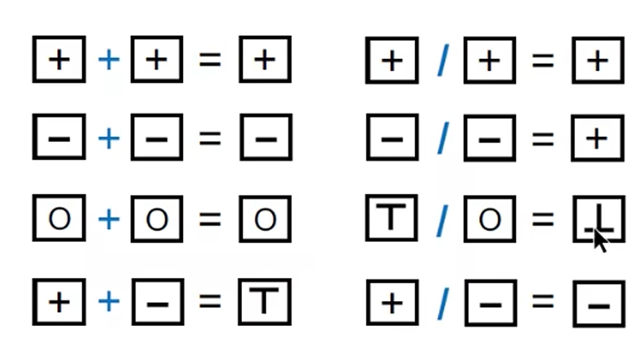
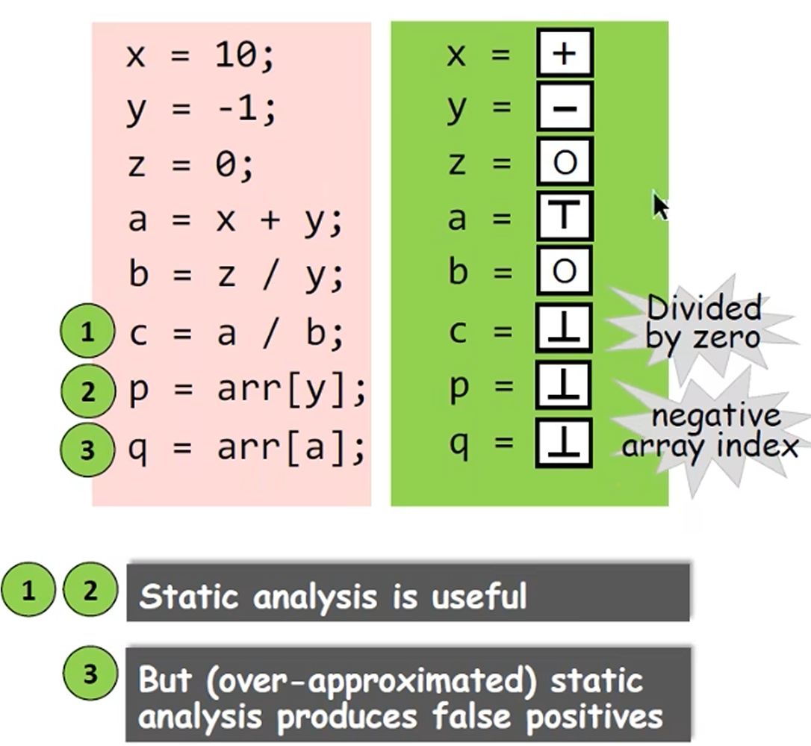

# Static Program Analysis - Introduction

> 学习南京大学软件分析课程的笔记

## Static Program Analysis (Static Analysis)

Programming Languages (PL)
- Theory
  - Language design 
  - Type system
  - Semantics and logics
  - ...
- Environment
  - Compilers
  - Runtime system
  - ...
- Application
  - **Program analysis** 
  - Program verification
  - Program synthesis

**Background:** In the last decade, the language cores had few changes, but the programs became significantly larger and more complicated.

- 命令型编程语言：C++, Java
- 函数式编程语言：Pascal
- 逻辑式编程语言：与或非

**Challenge:** How to ensure the **reliability, security and other promises** of large-scale and complex programs? 

## Why We Need Static Analysis?

不需要运行程序就可以检验出来程序的问题

- Program Reliability
  - Null pointer dereference, memory leak, etc.
- Program Security
  - Private information leak, injection attack, etc. 
- Compiler Optimization 编译优化，大多数优化方法都是使用编译优化
  - Dead code elimination, code motion, etc. 
- Program Understanding
  - IDE call hierarchy, type indication, etc.

**深入学习静态程序分析**
- 更深入地理解编程语言的语法、语义（不枯燥）
- 自然而然地写出更可靠、更安全、更高效的程序

## Static Analysis

*Static* analysis analyzes a program P to reason about its behaviors and determines whether it satisfies some properties *before running* P. 运行程序前了解程序的相关特征

- Does P contain any private information leaks?
- Does P dereference any null pointers?
- Are all the case operations in P safe?
- Can v1 and v2 in P point to the same memory location?
- Will certain assert statements in P fail?
- Is this piece of code in P dead (so that it could be eliminated)?

> Unfortunately, by **Rice's Theorem**, there is no such approach to determine whether P satisfies such non-trivial properties, i.e., giving *exact answer*: Yes or Now. 不存在这样的方法来判断

## Rice's Theorem 

"Any non-trival property of the behavior of programs in a r.e. language is undecidable."

> r.e. (recursively enumerable) = recognizable by a Turing-machine 即可以被图灵机识别的语言

A Property is trival if either it is not satisfied by any r.e. language, or if it is satisfied by all r.e. languages; otherwise it is non-trivial. 要么都有要么都没有的是trival

> non-trivial properties ~= interesting properties ~= the properties related with run-time behaviors of programs 与程序运行时行为相关的都是 Non-trival 的， 例如上述举例的隐私信息泄露等

## Perfect static analysis: Sound & Complete 

上述 Perfect static analysis 是不存在的 (即可以对non-trivial属性给出确切答案)

Truth, Sound 和 Complete 是包含与被包含的关系：

**Truth:** Sound & Complete, All possible true program behaviors

**Sound:** Overapproximate, 即一定包含 Truth 的所有内容

**Complete:** Underapproximate, 一定是 Truth 的子集

## Useful static analysis 

- Compromise soundness (false negatives) 即 Complete，漏报
- Compromise completeness (false positives) 即 Sound，误报


Mostly compromising completeness: **Sound** but not **fully-precise** static analysis

## Necessity of Soundness 

- Soundness is critical to a collection of important (static-analysis) applications such as *compiler optimization* and *program verification.* 


- Soundness is also preferable to other (static-analysis) applications for which soundness is not demanded, e.g., bug detection, as better soundness implies more bugs could be found.

## Static Analysis —— Bird's Eye View

```c++
if (input)
    x = 1;
else:
    x = 0;
→ x = ?
```

Two analysis results:
1. when input is true, x=1; when input is false, x=0   **Sound, precise, expensive**
2. x=1 or x=0   **Sound, imprecise, cheap**

这两个结论都是正确的

x = 0, 1, 2, 3, 4, 5 ... 此时可以认为 Soundness 就是 正确的
x = -1, 1 错误的

**Static Analysis:** ensure (or *get close to*) soundness, while making good trade-offs between analysis precision and analysis speed. 确保 soundess 的前提下，达到 precision 和 分析速度的平衡

## Two Words to Conclude Static Analysis

Abstraction + Over-approximation

### Static Analysis - An Example

Determine the sign (+, -, or 0) of all the variables of a given program, to check divided by zero error or to check negative array indices.
- Abstraction


- Over-approximation
  - Transfer functions
    - In static analysis, transfer functions define how to evaluate different program statements on abstract values.
    - Transfer functions are defined according to analysis problem and the semantics of different program statements.
    
    
  - Control flows
    - As it's impossible to enumerate all paths in practice, flow merging (as a way of over-approximation) is taken for granted in most static analyses. 
    
    ```c++
    x = 1;
    if (input)
        y = 10;
    else
        y = -1;
    z = x + y;
    ```

## 问题和总结

- What are the differences between static analysis and (dynamic) testing?
  - 静态分析是编译后无需执行即可检查到程序的一些问题
  - 动态测试则是需要程序运行起来
- Understand soundness, completeness, false negatives, and false positives.
  - Soundness更加全面，因此会存在一些 false positives 
  - Completeness代表所有样本都是正确的，因此会存在一部分 false negatives
- Why soundness is ~~usually~~ required by static analysis?
  - 因为全面性在大多数静态分析任务中都是更加重要的
- How to understand abstractin and over-approximation?
  - 抽象是把具体的值抽象成特定的符号或其它表示形式
  - Over-approximation 指的是在转换函数和控制流中为了减少复杂度，对于程序进行一些删减。


